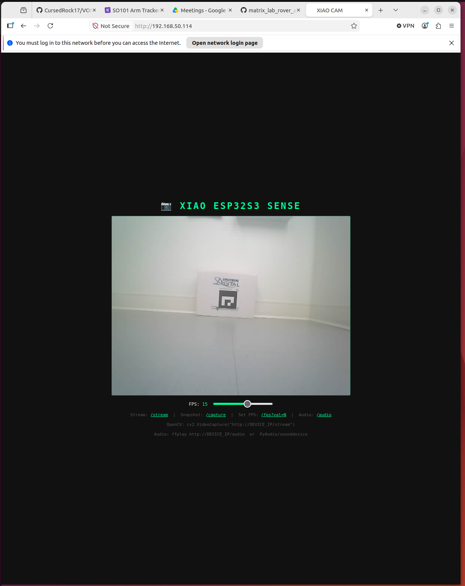

# ArUco Detector

## What this is

This folder finds ArUco markers (a kind of QR-code-like tag) in a camera image and turns each one
into a real-world position: how far forward, left/right, and vertical it is from the rover's
camera, in meters. `ArucoPoseEstimator` is the class that does this — point it at a camera stream,
and it hands you tag positions your control code can drive toward.

ArUco markers are *fiducial markers* made up of evenly-sized squares that are either filled black or left white. The pattern of filled squares encodes a unique integer ID. The design and detection algorithm is described in the foundational 2014 paper [Automatic generation and detection of highly reliable fiducial markers under occlusion](https://www.sciencedirect.com/science/article/abs/pii/S0031320314000235).

Three pieces of information are required to extract pose from a marker:
- The square side length (in meters) — measured from the outer edge of the black border
- The dictionary the marker belongs to
- The marker's integer ID within that dictionary

From these, the estimator returns the position (X, Y, Z) in meters and orientation (yaw) of the marker **as seen from the rover** — the camera is the origin, not the tag. This right-handed coordinate frame is:
- **+X:** Right
- **+Y:** Up
- **+Z:** Forward (into the scene)

OpenCV natively returns +Y pointing down; `ArucoPoseEstimator` flips the sign so +Y is up, matching the frame above and the output from the depth server's pose estimates.

For a deeper background on coordinate systems and why the reference frame choice matters, see [Coordinate Systems and Frames of Reference](https://eng.libretexts.org/Bookshelves/Mechanical_Engineering/Introduction_to_Autonomous_Robots_(Correll)/03%3A_Forward_and_Inverse_Kinematics/3.01%3A_Coordinate_Systems_and_Frames_of_Reference).

To print markers, use [Oleg Kalachev's ArUco Generator](https://chev.me/arucogen/).

---

## Design Decisions

### Why `DICT_4X4_250`?
A 4×4 grid encodes 16 binary bits — enough to represent 250 unique IDs while keeping the marker physically small enough to be detected at rover-scale distances (0.3–2 m). The 250-ID capacity leaves room to expand a course without reprinting markers. Smaller dictionaries (4×4\_50) would work for a single demo but run out of IDs quickly in a classroom setting with multiple simultaneous courses.

### Why sub-pixel corner refinement?
ArUco's default detector finds corners at full-pixel resolution. At 1 m, one pixel of error in the corner location translates to roughly 1–2 cm of error in the Z estimate. Sub-pixel refinement fits a local intensity gradient around each corner and finds the exact sub-pixel crossing point, reducing that error to a small fraction of a pixel. This matters most when the rover is deciding whether it has arrived at a tag — a 2 cm Z error can cause it to stop too early or overshoot.

### Why the reprojection error quality gate?
The ArUco detector can occasionally find false corners — particularly in scenes with rectangular objects like doors, whiteboards, or books. The quality gate works by taking the pose estimate, projecting the known 3D marker corners back through the camera model, and measuring how far the re-projected corners land from the detected corners (in pixels). If that error exceeds the threshold (default 4.0 px), the detection is discarded. This prevents the rover from reacting to a false tag, at the cost of occasionally dropping a legitimate detection in a difficult frame — a worthwhile trade for a control system where a single bad measurement can send the rover in the wrong direction.

## Calibrating your Camera
A calibrated camera is required for meaningful pose estimates. Without calibration the (X, Y, Z) numbers will be systematically wrong — the camera matrix and distortion coefficients correct for lens distortion and map image pixels to real-world angles. A calibration script and example `.yaml` output file are in the [calibration](calibration/) folder.

The checkerboard calibration procedure here is adapted from an [automaticaddison](https://automaticaddison.com/how-to-perform-pose-estimation-using-an-aruco-marker/) guide.

1. Print [pattern.png](calibration/pattern.png) on A4 paper, landscape orientation, so the checkerboard fills most of the page.
2. Capture at least 10 photos from varied angles and distances (`.jpg` format, saved in `calibration/`). The checkerboard must be fully visible in each frame with minimal blur.
3. Run the [calibration script](calibration/coolest_calibrator.py). It outputs a camera matrix and distortion coefficients vector that you pass directly to `ArucoPoseEstimator`.


## ArUco Pose Estimator Class — Quick Integration Guide

This class wraps ArUco marker detection, pose estimation, and smoothing into a reusable interface that can be dropped into any existing control loop.

---

### 1. Initialization

Create the estimator once, outside your main loop:

```python
estimator = ArucoPoseEstimator(
    camera_matrix=camera_matrix,
    dist_coeffs=dist_coeffs,
    marker_length_m=0.10,
    http_addr="http://192.168.50.123:80/capture",
    verbose=True,  # set False if you only want data
)
```

### 2. Use Inside a Control Loop
Call `process()` once per iteration. It returns the freshest frame from the background reader **without blocking**, so pace your own loop (a short sleep) instead of spinning the CPU.

```python
import time

while True:
    frame, poses = estimator.process()
    if poses:
        print(poses)

    # Optional display if verbose=True
    if frame is not None:
        cv2.imshow("Aruco", frame)

    if cv2.waitKey(1) & 0xFF == ord("q"):
        break

    time.sleep(0.05)  # ~20 Hz - process() no longer blocks, so pace the loop yourself
```

### 3. Query for a Marker Position
You can directly query a marker without processing the full dictionary:

```python
pos = estimator.get_position(marker_id=1)
print(pos)  # [x, y, z] or None if not seen
```

---

## Troubleshooting

**Can't reach the camera stream**
Each rover's IP address is written on it. Cameras are in the `.123` range; the rover's UDP control endpoint is in the `.223` range (example: `192.168.50.123` camera, `192.168.50.223` rover). Confirm you are on the same WiFi network and ping the camera first: `ping 192.168.50.123`. If this works, you'll get a response similar to the following: `64 bytes from 192.168.50.123: icmp_seq=1 ttl=64 time=18.5 ms`.

Next, you should have the capability to view the current camera feed on the rover using a Web Browser. Since we've confirmed that we're on the same WiFi network as our rover and that the camera's IP exists. Enter the IP address of your camera into a web browser in a similar format: `http://192.168.50.123:80`, which should return the following page:



**Camera endpoints**
The ESP32 camera exposes two endpoints on port 80:
- `GET /capture` — returns a single JPEG still. This is what `ArucoPoseEstimator` uses; it has lower latency per frame than the stream.
- `GET /stream` — returns a continuous MJPEG stream. Useful for the viewer window, but the camera can overheat if left streaming for extended periods.

**Marker detected in the viewer but rover does not respond**
This is a frame-timing issue. `ArucoPoseEstimator` gates frames by timestamp — it only uses frames captured *after* the rover stops moving, so stale frames (with motion blur) are automatically discarded. If the tag consistently appears in the viewer but not in the terminal, the frame is arriving before the rover has fully halted. Increase the `stop_settle_s` parameter (default 0.15 s) to give the camera more time to capture a stable frame after stopping.

**Tag detected but pose is wrong (very large or erratic distances)**
The camera is not calibrated, or the calibration file path is incorrect. Verify that `camera_matrix` and `dist_coeffs` are loaded from the `.yaml` file in `calibration/` and not left at their defaults.

**Poor detection under classroom lighting or after JPEG compression**
Camera settings (JPEG quality, brightness, exposure) are compile-time constants in the rover firmware — there is no HTTP control endpoint to change them at runtime. If detection is consistently poor, the fix is to update the relevant constants in `rover_camera_firmware/` and reflash the affected rovers. The settings to look at are `STREAM_QUALITY` (lower = better JPEG quality), `set_brightness`, `set_contrast`, and `set_ae_level` in the camera init block.

