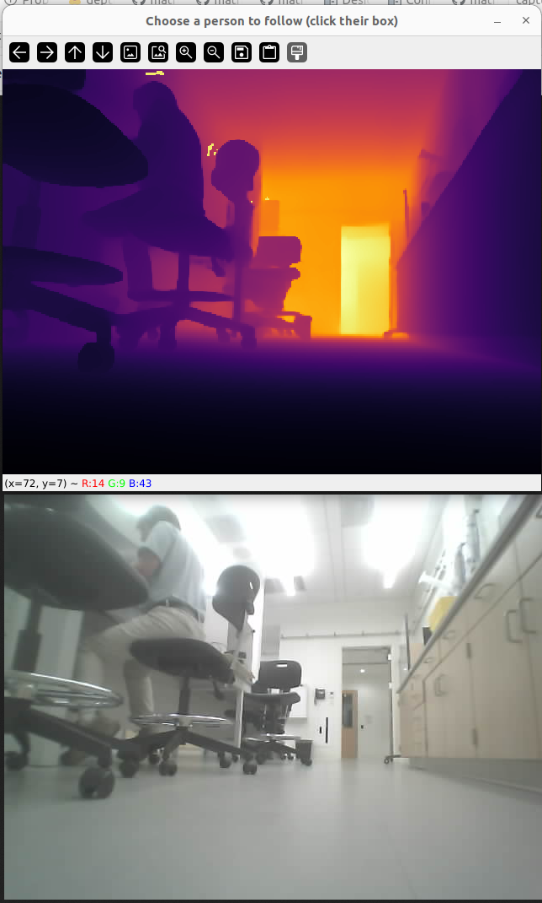
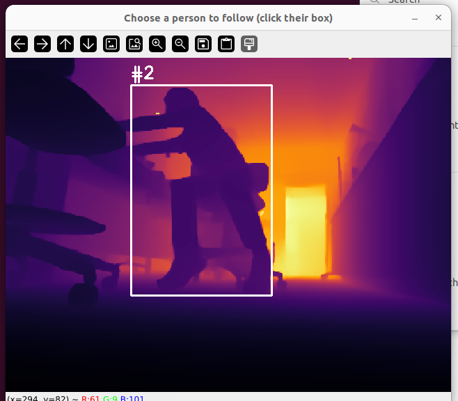
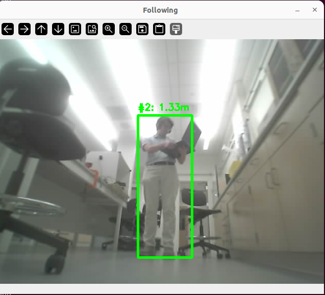

# DA3 Person Picker

This example is the "choose who to follow" version of the DA3 object follower: it asks a GPU server (`depth_anything_server`) for a metric depth map and drives the rover toward a person using PID control, but instead of just following the first person YOLO happens to see, it shows every person currently visible on a depth-colored view, waits for a click, and then follows only that specific person as they move.

This is what it looks like running end to end - a person picked from the depth view, then followed:

<video src="../../images/da3_person_tracker_video.webm" controls width="640"></video>

(if your viewer doesn't render the video inline, it's at [images/da3_person_tracker_video.webm](../../images/da3_person_tracker_video.webm))

## Prerequisites

- A GPU depth server running (`depth_anything_server/depth_server.py`) and reachable on the network - see [Depth Server](depth-server.md)
- The physical rover, its ESP32 camera reachable over HTTP, and its motors/firmware listening for velocity commands
- `ultralytics`'s `lap` dependency (`lap>=0.5.12`, pinned in `pyproject.toml`) - without it, Ultralytics' persistent tracker tries to `pip install` it on first use, which just hangs on a network with no internet
- Open floor space - the rover will actually drive during this example

Every setup's IPs are different (rover, camera, and GPU server addresses won't match another student's), so all three are command-line flags rather than hardcoded constants:

```bash
uv run --extra cu121 rover_control/examples/da3_person_picker.py \
    --server <YOUR_GPU_LAPTOP_IP>:5000 \
    --camera-ip <YOUR_ROVER_CAMERA_IP>:80 \
    --rover-ip <YOUR_ROVER_IP>
```

`--server`/`--camera-ip` fall back to placeholder values from this project's example network if omitted; `--rover-ip` (where motor commands get sent over UDP - different from `--camera-ip`, which is where camera frames get fetched over HTTP) falls back to the `ROVER_IP` environment variable, or `network_interface.py`'s own default.

## Run it

A window titled "Choose a person to follow (click their box)" opens first, showing the depth-colored view with every detected person boxed and labeled. Click one to start following them - the window switches to a "Following" view showing their live distance. Press `q` in either window to abort, or Ctrl-C to stop immediately.

## How it works

### One piece of state, two phases

The whole script is one loop with a single piece of state, `self.chosen_id`:

- **`chosen_id is None` (picking):** every person currently visible gets shown, labeled, and is clickable. Nothing drives yet.
- **`chosen_id` is set (following):** the rover tries to find that specific person in each new frame and drives toward them.

Nothing else branches the script's behavior - no separate "modes" to track, just one variable that's either `None` or an ID.

### Tracking people with persistent IDs

A single detection call (like `YOLOExtractor.process()`, used by `da3_object_movement.py`) finds people in one frame with no memory of previous frames - if two people are in the shot, there's no way to know that "person A" in this frame is the same person as "person A" in the last frame. That's fine for following whoever's simply closest, but not for following one *specific* chosen person while others are also in view.

`YOLOExtractor.track()` (added in `YOLO_agent/YOLO_extractor.py` alongside the existing `process()`, which is untouched) solves this by calling Ultralytics' built-in tracker instead of a plain detection pass:

```python
results = self.model.track(
    frame,
    persist=True,  # remember previous frames' tracks instead of starting fresh each call
    conf=self.confidence,
    imgsz=self.imgsz,
    classes=classes,
    verbose=False,
)[0]
```

`persist=True` is what makes this tracking rather than one-off detection: Ultralytics keeps its own internal state between calls and assigns the same numeric ID to what it believes is the same physical person, using their motion and appearance across frames (ByteTrack, under the hood - a black box as far as this script is concerned). Every returned detection now carries an `"id"` key alongside the usual `"box"`/`"confidence"`/`"name"`. A detection can come back with `box.id is None` if the tracker hasn't confirmed an ID for it yet - `track()` just drops those rather than reporting a person with no usable identity.

Every loop tick calls this regardless of whether we're picking or following:

```python
people = self.extractor.track(frame, classes=[PERSON_CLASS_ID])
people = [p for p in people if p["confidence"] > self.CONFIDENCE_THRESH]
```

`classes=[PERSON_CLASS_ID]` (COCO class `0`) keeps the tracker from wasting time on other COCO classes. The confidence filter afterward matches `da3_object_movement.py`'s stricter 0.80 threshold - the extractor's own default is a looser 0.5.

### Turning depth into a pickable image

Here's the same moment shown two ways - the depth colormap `_show_picker()` builds (top) next to the plain camera frame it's built from (bottom), so you can see what the INFERNO gradient is actually encoding:



While `chosen_id is None`, `_show_picker()` builds the image you click on:

```python
def depth_to_colormap(depth_map, max_display_depth=10.0):
    depth_clipped = np.clip(depth_map, 0, max_display_depth)
    depth_normalized = cv2.normalize(depth_clipped, None, 0, 255, cv2.NORM_MINMAX, dtype=cv2.CV_8U)
    return cv2.applyColorMap(depth_normalized, cv2.COLORMAP_INFERNO)
```

This is the same normalize-then-colorize recipe as [`depth_map_local_camera.py`](../../depth_anything_server/examples/depth_map_local_camera.py): clip anything past 10 m (so one far-away outlier pixel doesn't wash out the color scale), squash the remaining range into 0-255, then map that onto a color gradient (`INFERNO`: warm colors are close, cool colors are far).

`_show_picker()` then draws every tracked person's box and ID number directly on that colormap, and - this is the part that makes clicking work - records each box's pixel coordinates in `self._visible_boxes`, keyed by track ID:

```python
self._visible_boxes[person["id"]] = (x1, y1, x2, y2)
```

`_on_click()`, registered once via `cv2.setMouseCallback`, is what OpenCV calls when you click inside that window. It just checks which recorded box (if any) contains the click point, and if one does, sets `self.chosen_id`:

```python
def _on_click(self, event, x, y, flags, param):
    if event != cv2.EVENT_LBUTTONDOWN:
        return
    for track_id, (x1, y1, x2, y2) in self._visible_boxes.items():
        if x1 <= x <= x2 and y1 <= y <= y2:
            self.chosen_id = track_id
```

Because `_visible_boxes` is refreshed every tick from that tick's live tracker output, a click always tests against boxes from a genuinely recent frame - there's no separate "freeze the picker" step. Here's the picker window with a real tracked box and ID label drawn on it, ready to click:



### Once you've picked someone

The main loop looks up `chosen_id` in this tick's tracked people:

```python
match = next((p for p in people if p["id"] == self.chosen_id), None)
```

If found, distance comes from `calculate_filtered_distance()` - identical logic to `da3_object_movement.py`'s method of the same name (see [depth_anything_server/README.md](../../depth_anything_server/README.md#rationale)'s "Filtering the Images" writeup for why a raw average over the box is noisy and a histogram peak isn't): bucket every depth pixel inside the box into 5 cm bins, find the most common bucket, and average only the pixels within 15 cm of that peak. That throws out background pixels that leak in around an irregularly-shaped person inside a rectangular box.

Sideways offset is worked out from how far the box's center sits from the image's center, in pixels, converted to meters with the camera's focal length - then both numbers feed the same two-PID steering (`distance_pid` for forward speed, `heading_pid` for turning) that `da3_object_movement.py` uses, via `wheel_speeds_for()`.

This is `_show_following()`'s window during an actual approach - the chosen person's ID and live distance overlaid on the plain camera frame:



### When the person disappears

If `chosen_id` isn't found in a tick's people (they left frame, or something broke the track), the rover sends zero velocity and just keeps looping, still calling `track()` every tick:

```python
if match is None:
    print(f"Lost person #{self.chosen_id}, waiting for them to reappear...")
```

This is deliberately the simple option: no fallback state, no re-showing the picker. The trade-off is that Ultralytics' tracker doesn't always hand back the *same* ID after a real occlusion or someone leaving and re-entering frame - if that happens, this script just waits indefinitely at that spot until you restart it and pick again. Worth knowing if the rover seems to "give up" on someone who's clearly still in the room; not yet stress-tested how reliably re-acquisition works in practice.

### Two environment issues worth knowing about

Getting this running for real surfaced two non-obvious gotchas:

- A `uv run` invocation without `--extra cu121` (even for something unrelated, in the same checkout) can silently swap the shared venv's CUDA/cuDNN packages out from under an already-running GPU process, breaking it later with a confusing `CUDNN_STATUS_NOT_INITIALIZED` rather than an obvious import error. Always pass `--extra cu121` for every `uv run` in this checkout while doing GPU work.
- Ultralytics' `.track()` needs the `lap` package, which it will otherwise try to `pip install` on first use - fine with internet, a silent hang without it. It's a pinned dependency now (`pyproject.toml`), so a plain `uv sync` covers it.

## See also

- [DA3 Object Follower](../../rover_control/examples/da3_object_movement.py) - the simpler "auto-follow the first person seen" version this builds on
- [Depth Server](depth-server.md) - the GPU server this depends on
- [rover_control/](../../rover_control/) - the Rover base class and other examples
- [Back to README](../../README.md)
