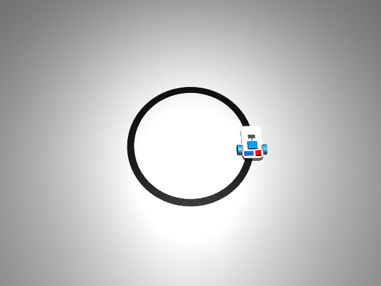

# Sim Line Follower (PID)

This example drives the simulated rover around a generated track using only its onboard camera and a classical PID (or simple bang-bang) controller — it's the non-learned baseline that the reinforcement-learning line followers are later compared against.

## Prerequisites

- A `uv sync` of the workspace — the script imports `mujoco`/`mujoco.viewer`, `numpy`, and `matplotlib` (used with the `Agg` backend to save a trajectory plot), plus `PIL.Image` and, if you pass `--camera`, `opencv-python` (`cv2`) for the live diagnostic window.
- No GPU, no trained model, and no track files on disk — tracks are generated in memory from waypoint functions in `envs/tracks.py` and built into a MuJoCo scene by `envs/line_scene.py`.
- For headless runs (no GUI, e.g. over SSH or in CI), set `MUJOCO_GL=egl` so MuJoCo renders offscreen instead of trying to open a window.

## Run it

```bash
# Watch the rover and the exact camera pixels used for steering.
uv run rover_mujoco/scripts/line_follower.py --track figure8 --camera

# Evaluate fresh initial offsets without opening a viewer.
MUJOCO_GL=egl uv run rover_mujoco/scripts/line_follower.py --headless --track all --episodes 20 --seed 100
```

With `--camera`, a MuJoCo viewer opens showing the rover on the track plus a second OpenCV window showing the raw camera image with detected line pixels in red and the steering centroid in green; the run finishes by writing episode outcomes, trajectory CSVs, and a comparison plot under `artifacts/pid/<timestamp>`.



## How it works

Each episode needs to start the rover at a slightly randomized, but track-relative, position and heading. `rng.uniform` picks a small lateral offset and yaw jitter around the track's starting tangent so consecutive episodes aren't identical.

```python
    rng = np.random.default_rng(seed)
    points = np.asarray(waypoints)
    lengths, closed = path_length_table(points)
    tangent = points[1] - points[0]
    tangent /= np.linalg.norm(tangent)
    normal = np.array([-tangent[1], tangent[0]])
    lateral = rng.uniform(-0.01, 0.01)
    yaw_offset = rng.uniform(-math.radians(5), math.radians(5))
```

Before the control loop starts, the script lets the rover physically settle onto the ground for one simulated second. Without this, the rover would still be mid-drop from however it was spawned when the first control decision is made.

```python
    data = mujoco.MjData(model)  # ty: ignore[unresolved-attribute]
    data.qpos[:2] = points[0] + lateral * normal
    data.qpos[3:7] = [math.cos(yaw / 2), 0, 0, math.sin(yaw / 2)]
    # Settle the free body before measuring the camera and starting the control clock.
    mujoco.mj_step(model, data, nstep=round(1 / model.opt.timestep))  # ty: ignore[unresolved-attribute]
    mujoco.mj_forward(model, data)  # ty: ignore[unresolved-attribute]
```

The control loop runs slower than physics: physics steps at a fine timestep for accuracy, but the controller only needs to re-decide steering 10 times a second, matching the camera's effective frame rate. `substeps` is how many physics steps happen between each control decision.

```python
    substeps = round(1 / CONTROL_HZ / model.opt.timestep)
    dt = substeps * model.opt.timestep
    pid = LinePID(args.kp, args.ki, args.kd, 10 - args.speed)
```

Every step, the script renders what the onboard camera sees and extracts a single number: how far off-center the black line is (`error`), or `None` if no line is visible at all. A run of consecutive missing detections (half a second's worth) is treated as a failure — the line is lost, not just briefly occluded.

```python
            renderer.update_scene(data, camera="top_cam")
            frame = renderer.render()
            error, mask = centroid_error(frame)
            ...
            missing = missing + 1 if error is None else 0
            if missing * dt >= 0.5:
                data.ctrl[:] = 0
                reason = "line_lost"
                break
```

This is the actual steering decision. The PID controller turns the centroid error into a steering correction; on a momentary dropout it holds the last known steering rather than panicking. `--controller bang_bang` swaps in a much simpler rule for comparison: steer hard one way or the other whenever the error crosses a small threshold, otherwise go straight.

```python
            correction = pid.update(error, dt)
            steering = last_steering if error is None else correction
            if args.controller == "bang_bang" and error is not None:
                steering = -3.0 * np.sign(error) if abs(error) > 0.05 else 0.0
            steering = float(np.clip(steering, -pid.limit, pid.limit))
            last_steering = steering
            data.ctrl[:] = [-args.speed + steering, args.speed + steering]
            mujoco.mj_step(model, data, nstep=substeps)  # ty: ignore[unresolved-attribute]
```

Steering alone doesn't tell you whether the rover is actually following the track well — for that the script needs ground-truth geometry, which the controller itself never sees. It projects the rover's true position onto the nearest point of the track's centerline to measure both forward progress and lateral deviation, restricting the search to nearby track segments so it can't accidentally "jump" across the figure-eight's crossing point.

```python
            s, segment = project_arc_length(
                points, lengths, data.qpos[:2], segment, window=4, closed=closed
            )
            delta = s - s_prev
            if closed:
                delta = (delta + lengths[-1] / 2) % lengths[-1] - lengths[-1] / 2
            progress += delta
```

An episode ends for one of a few reasons: it drifted too far off the track, it finished a full lap, or the camera lost the line for too long. Recording *why* an episode ended (not just pass/fail) is what makes the results useful for comparing controllers or diagnosing failures.

```python
            if deviation > args.max_deviation:
                reason = "off_track"
                break
            if progress >= lengths[-1] - 0.03:
                reason = "completed"
                break
```

`main` parses all the tuning knobs (`--kp`, `--ki`, `--kd`, `--speed`, `--track`, etc.), validates them, and then loops over one or more tracks and seeds, calling `run_episode` for each and plotting every trajectory against the track's true centerline for a quick visual sanity check.

```python
    parser.add_argument("--controller", choices=["pid", "bang_bang"], default="pid")
    parser.add_argument("--episodes", type=int, default=1)
    parser.add_argument("--seed", type=int, default=0)
    parser.add_argument("--duration", type=float, default=120)
    parser.add_argument("--speed", type=float, default=3.0, help="forward wheel speed, rad/s")
    parser.add_argument("--kp", type=float, default=2.0)
    parser.add_argument("--ki", type=float, default=0.0)
    parser.add_argument("--kd", type=float, default=0.1)
```

## See also

- [rover_mujoco/](../../rover_mujoco/) — the simulation environment this example depends on
- [rover_mujoco/docs/pid-line-follower.md](../../rover_mujoco/docs/pid-line-follower.md) — an in-depth writeup of the controller, camera assumptions, and measured baseline results
- [Back to README](../../README.md)
