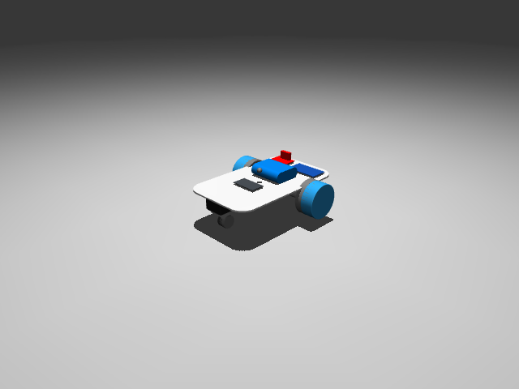

# Sim Manual Control

This example opens the simulated rover in the MuJoCo 3D viewer and lets you drive it around with the arrow keys. It's built the same way the real rover is controlled: differential-drive kinematics (turning a forward/turn speed into left/right wheel speeds) feeding a fixed-rate, 10 Hz command loop, matching `rover_control/rover.py`'s `COMMAND_RATE_HZ` on the physical firmware. Because the sim is driven through that identical command interface, steering logic you get working here should behave the same way on the real rover - that symmetry is the whole point of testing in sim first, rather than debugging kinematics directly on hardware.

## Prerequisites

- A `uv sync` of the workspace (from the repository root) — this pulls in `mujoco`, `mujoco.viewer`, `gymnasium`, and `numpy`, the only imports the script uses.
- A display: `mujoco.viewer.launch_passive` opens a native OpenGL window, so this won't run over a headless/SSH session without a virtual display.
- Nothing else — no trained policy, no generated track, no GPU. The rover model (`assets/robots/rover/rover_scene.xml`) ships in the repo and is loaded through the `Rover-v0` Gymnasium environment registered by `envs/__init__.py`.

## Run it

```bash
uv run rover_mujoco/scripts/teleop_rover.py
```

A MuJoCo viewer window opens with the rover sitting on the floor. **Hold** an arrow key to drive - the rover only moves while a key was (recently) pressed, same as the real rover only drives for as long as it keeps receiving fresh commands. `+`/`-` change the top speed, Space stops it, and Esc closes the window.



## How it works

### One command per loop tick, just like the real rover

The whole script runs one loop at `COMMAND_RATE_HZ` (10 Hz), sending one wheel-speed command per tick and holding it for that tick's duration - there's no ramping or smoothing in the loop itself:

```python
COMMAND_RATE_HZ = 10.0
COMMAND_PERIOD_S = 1.0 / COMMAND_RATE_HZ
```

A key press is only remembered for one tick, so a direction key has to keep getting re-pressed - which is what holding it down does, via keyboard auto-repeat - to keep the rover moving:

```python
def held(last_press_time, now):
    return now - last_press_time <= COMMAND_PERIOD_S
```

### Reading the keyboard

`on_key` is the callback MuJoCo calls on every keypress. It doesn't drive the rover directly - it just stamps the current time into that key's `last_*` variable, which `held()` (and so the main loop) reads back out:

```python
def on_key(keycode):
    global speed, last_up, last_down, last_left, last_right
    now = time.perf_counter()
    if keycode == GLFW_KEY_UP:
        last_up = now
    elif keycode == GLFW_KEY_DOWN:
        last_down = now
    elif keycode == GLFW_KEY_LEFT:
        last_left = now
    elif keycode == GLFW_KEY_RIGHT:
        last_right = now
    elif keycode == GLFW_KEY_SPACE:
        last_up = last_down = last_left = last_right = -1.0
    elif keycode == GLFW_KEY_EQUAL:
        speed = min(speed + SPEED_STEP, MAX_SPEED)
        print(f"speed: {speed:.1f} rad/s")
    elif keycode == GLFW_KEY_MINUS:
        speed = max(speed - SPEED_STEP, MIN_SPEED)
        print(f"speed: {speed:.1f} rad/s")
```

`global` is required to assign to `speed`/`last_up`/etc. here - without it, `speed = ...` would create a new local variable instead of updating the module-level one `main()`'s loop reads.

Arrow keys, not WASD: MuJoCo's own viewer already binds every letter to a built-in rendering toggle (`W` for wireframe, `S` for shadows, and so on) and runs those bindings on every keypress no matter what this callback does, so WASD would silently flip rendering settings while you drive.

### Kinematics: turning speed into wheel commands

Each loop tick, the script works out how fast to go straight and how fast to turn, then mixes those into a left/right wheel speed - the same differential-drive math every two-wheeled robot uses:

```python
linear = speed * (held(last_up, tick_start) - held(last_down, tick_start))
turn = held(last_left, tick_start) - held(last_right, tick_start)
angular = speed * ANGULAR_RATIO * turn
left_speed = -linear + angular
right_speed = linear + angular
```

The leading `-` on the left wheel isn't textbook differential-drive math - it's because this rover's CAD wheel meshes are mirrored, so the two wheel joints spin in opposite senses for the same physical rolling direction (the same sign convention `rover_control/rover.py`'s `ENCODER_SIGNS` documents on the real hardware).

### Sending the command and staying in real time

The computed wheel speeds go straight to the sim, then the loop sleeps just long enough to keep the whole thing running at `COMMAND_RATE_HZ`, not as fast as the CPU can go:

```python
env.step(np.array([left_speed, right_speed], dtype=np.float32))
viewer.sync()

elapsed = time.perf_counter() - tick_start
if elapsed < COMMAND_PERIOD_S:
    time.sleep(COMMAND_PERIOD_S - elapsed)
```

## See also

- [rover_mujoco/](../../rover_mujoco/) — the simulation environment this example depends on
- [Back to README](../../README.md)
