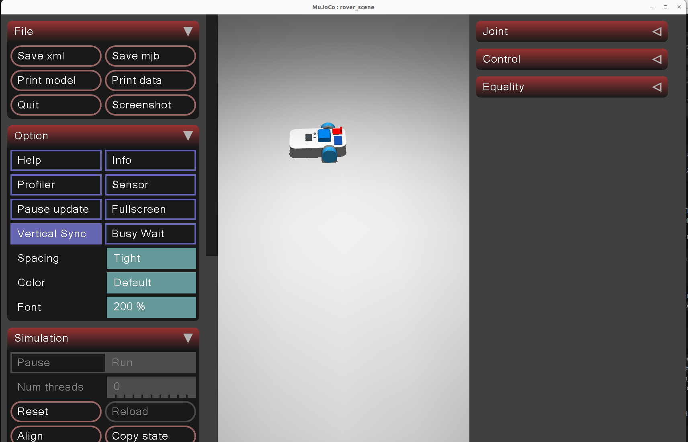

# Rover MuJoCo
This is a MuJoCo environment which will fascilitate the simulation and training of our differential drive, Mini Claw STEM rovers in a easy to setup, fast, simple, yet robust training environments

## Prerequisites
You should have already installed these items one level up, but just in case.
This environment should be system-agnostic since we're using dedicated Python virtual environments without (for now) requiring access to a GPU, so it should work on Linux, Mac, and Windows.
Prior to starting, we recommend installing the following software:
- **[uv](https://docs.astral.sh/uv/getting-started/installation/)**, which manages the Python virtual environment and dependencies. It installs Python 3.12 (see `requires-python` in `pyproject.toml`) for you.
- **[VSCode](https://code.visualstudio.com/download)** (optional, but recommended): this repo ships a `.vscode/extensions.json` with recommended extensions (Python, Ruff, a MuJoCo viewer)

It's not a requirement, but you should be familiar with the [MuJoCo Documentation](https://mujoco.readthedocs.io/en/stable/overview.html) and it's useful to know basic [Reinforcement Learning Concepts](https://huggingface.co/learn/deep-rl-course/en/unit1/rl-framework)

## Getting Started
All of the development for creating scripts will occur in Python, thus we'll be using [uv](https://docs.astral.sh/uv/) to maintain a Python virtual environment.

This directory is a member of the parent repo's [uv workspace](https://docs.astral.sh/uv/concepts/projects/workspaces/):
it keeps its own `pyproject.toml`, but shares one `uv.lock` and one `.venv/` with the high-level
rover code. So clone and sync from the **repository root**, not from here. This of course should've already be done based on the high level documentation. But in case you have to do it again, you can do it here.

Clone this repository locally. If your using VSCode, simply open VSCode and reveal the command prompt at the top of the screen (1) using `Ctrl + Shift + P`. Then type `Git: Clone` (2) and press `Enter`. You should be able to paste the URL of this repository and press `Enter`. Save this repository a desired directory like "~/Documents" and you should be good.


Otherwise, you can do it via the terminal:
```bash
# Navigate to where you want to install this package
cd ~/Documents/
git clone https://github.com/CursedRock17/matrix_lab_rover_above.git
```

### Repository Setup

Open the project up in VSCode (optional, but recommended). This can be done very simply through VSCode via `File` > `Open Folder`, then going to the location that you cloned the repository.

Alternatively, navigate to the location of the project using the terminal

```bash
# If you cloned the repo to a different path, use that one.
cd ~/Documents/matrix_lab_rover_above
code .
```

From the project root, sync the environment. Pick the extra that matches your machine. To do this we need to open a terminal. If you're in VSCode either type `Ctrl + "`"` (Control plus Backtick) or go to `View` > `Terminal`.

```bash
uv sync --extra cpu     # no NVIDIA GPU (saves ~6 GB)
```

This reads `pyproject.toml`/`uv.lock` and builds a single `.venv/` on Python 3.12 containing every
package in the repo.


That single sync installs MuJoCo, Gymnasium, and stable-baselines3 alongside the ArUco/YOLO/LLM
packages, so a policy trained here is importable from `rover_control/` without switching
environments. There's no separate `uv init` or a second `uv sync` in this folder.

See [`docs/workspace-setup.md`](docs/workspace-setup.md) for the full walkthrough: verifying
MuJoCo actually opens a window, adding your own packages on top of the baseline set, and notes
for Windows/Mac/Linux.

## Exploring
Now that you've got the repository setup, we recommend starting with the [manual control](scripts/teleop_rover.py) example to see that the 3D MuJoCo viewer works and the rover implementation is clean:
In a `uv sync`'d shell, run:

```shell
cd ~/Documents/matrix_lab_rover_above
uv run rover_mujoco/scripts/teleop_rover.py
```



You should be able to use WASD/Arrow Key controls to drive a rover around following differential drive characteristics.

**Going Further**
The main goal of this directory is simulation to real life transfer with our Mini Claw STEM Rover which will allow individuals using the rovers to test their algorithms, control, RL policies, and more in simulation then deploy them in real life.

The [Zero to Hero tutorial](<docs/Deploying a Mini Claw Rover Policy _ Zero to Hero.md>)
documents the completed PID → nominal PPO → DR/BAM → physical-rover journey,
with measured results, figures, W&B runs, and saved policies.

The following table denotes the out of box capabilites of the current environment

| Task | Script | Descriptions |
|------|--------|--------------|
| Manual Control | [`scripts/teleop_rover.py`](scripts/teleop_rover.py) | Use the arrow keys to manually drive around the rover, following differential drive kinematics through the same fixed-rate command loop the real rover uses ([docs](../docs/examples/sim-manual-control.md)) |
| Track Generation | [`scripts/gen_track.py`](scripts/gen_track.py) | Build a black line track as an MJCF fragment from a list of (x, y) waypoints. Called by `envs/line_scene.py` at scene-build time, so no track files are written to disk |
| Track from CAD | [`scripts/extract_centerline.py`](scripts/extract_centerline.py) | Turn a flat CAD track mesh into the centreline polyline the environments need, scaling it and rounding cusps the rover cannot drive ([docs](docs/onshape-to-robot-mjcf.md)) |
| Line Following (Classical) | [`scripts/line_follower.py`](scripts/line_follower.py) | Follow a track using only the onboard camera with a PID or bang-bang controller, with a tiltable camera mount, the classical-control baseline ([docs](docs/pid-line-follower.md)) |
| Line Following (PPO baseline) | [`scripts/train_ppo.py`](scripts/train_ppo.py), [`scripts/evaluate_ppo.py`](scripts/evaluate_ppo.py) | Train and evaluate on the PID baseline’s 2-inch closed tracks, with camera centroids, wheel encoders, W&B, and TensorBoard ([docs](docs/ppo-line-follower.md)) |
| Line Following (hyperparameters) | [`scripts/sweep_ppo.py`](scripts/sweep_ppo.py) | Sweep PPO settings against the nominal baseline on a matched budget, scoring each per track ([docs](docs/ppo-hparam-sweep.md)) |
| Line Following (DR and BAM) | [`scripts/train_ppo.py --dynamics dr`](scripts/train_ppo.py) | Train against the measured motor model and domain randomization, the stage that transfers to hardware ([docs](docs/dr-bam-line-follower.md)) |
| Training Curves | [`scripts/plot_ppo_training.py`](scripts/plot_ppo_training.py) | Export the TensorBoard scalars mirrored to W&B as a shareable figure |
| Publishing | [`scripts/publish_policy.py`](scripts/publish_policy.py) | Check a policy against the deployment contract, smoke-run it, and refuse to upload without qualifying evidence |
| Policy Recovery | [Download guide](docs/policy-downloads.md) | Restore a verified policy and its configuration from the private Hugging Face backup, then run it in simulation. |

Trained policies are deployed to the physical rover from the parent repo — see
`rover_control/rl_rover.py` and `rover_control/examples/rl_line_follower.py`.
