# Deploying a Mini Claw Rover Policy: Zero to Hero

We taught a custom CAD rover to follow a line: first with camera-based PID, then
with PPO trained in MuJoCo, and finally on hardware after adding domain
randomization (DR) and Better Actuator Models (BAM).
This guide records the full experiment: setup, failures, training decisions,
independent simulation tests, and the successful physical rollout.

The models and experiment artifacts are preserved in a
[dated Hugging Face backup](https://huggingface.co/CursedRock17/rover-line-follower-ppo/tree/main/backups/2026-09-10).
That repository is private, so downloading its files requires an authorized HF
account; the figures below are stored in this Git repository for direct viewing.

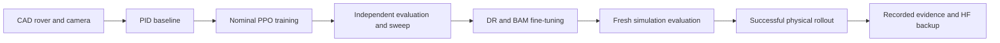

| Stage | What it established | Recorded result |
| --- | --- | --- |
| PID | The camera, rover geometry, and control rate support the task. | 20/20 on each original closed track. |
| Nominal PPO | A learned policy can solve the same task without a PID fallback. | 40/40 per original track in the expanded evaluation. |
| Nominal sweep | Controlled continuations expose accuracy and speed tradeoffs. | Selected continuation: 50/50 per original track. |
| DR/BAM | PPO can adapt to motor limits and sampled physical/sensor variation. | 50/50 per original track under DR; 20/20 on unseen Goomba. |
| Physical rover | The selected DR policy transfers to the real line-following task. | Successful hardware operation, reported by the experimenter. |

All episode counts below come from simulation.
The successful hardware demonstration has no measured 90% success rate.

### How to use this guide

By the end, you'll have a policy trained entirely in simulation driving the real
rover around a line-following track. That takes ten stages, matching the table
above: get the workspace and hardware ready, prove a simple controller can do the
task at all, define the learning problem, train a policy, sweep its settings,
make it robust to real motor/sensor imperfections, test it on fresh conditions,
then deploy and verify it. You don't have to read it start to finish in one
sitting — each section below is numbered to match the table, so you can jump to
whichever stage you're working on.

## 1. Set up the rover and workspace

### Hardware and software

Use an assembled Mini Claw Rover, its ESP32 camera, a USB data cable for flashing,
and a computer that can communicate with both devices.
The workspace uses `uv` and requires **Python 3.12**, as declared in both
`pyproject.toml` files.
VSCode with PlatformIO is useful for firmware work; a GPU is not required for
these small PPO policies.

Examples use Bash on Linux.
The desktop viewer needs a graphical session; `MUJOCO_GL=egl` enables headless
camera rendering on supported Linux systems.
For other platforms and package variants, follow the
[workspace setup guide](workspace-setup.md).

```bash
# Clone the firmware and application repositories into one workspace.
mkdir -p ~/Documents/mini_claw_ws
cd ~/Documents/mini_claw_ws
git clone https://github.com/wmala2/rover-firmware.git
git clone https://github.com/wmala2/rover_camera_firmware.git
git clone https://github.com/CursedRock17/matrix_lab_rover_above.git

# Install the CPU workspace and open the CAD rover in MuJoCo.
cd matrix_lab_rover_above
uv sync --extra cpu
uv run rover_mujoco/scripts/teleop_rover.py
```

Use a repository revision containing this line-follower implementation.
The HF backup pins the weights and available training snapshots separately.

### Flash the rover and camera

Skip flashing if both boards already run the intended firmware.
Otherwise, open the workspace in VSCode, install PlatformIO IDE, and select the
firmware project through its `platformio.ini` file.
Set Wi-Fi credentials in the firmware's local configuration and use addresses
appropriate for your network.
The companion firmware repositories document their board and network settings.

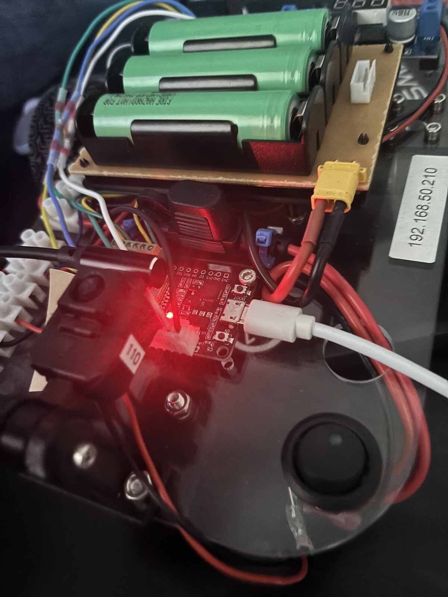

Run **PlatformIO: Build**, then **PlatformIO: Upload** with the rover connected by
USB; repeat for the camera firmware and camera board.
Verify the rover address and camera capture endpoint after flashing.

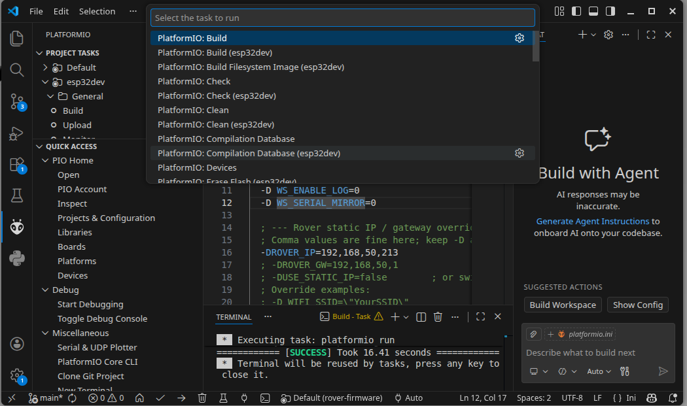

### Understand the simulation assets

The custom rover lives in [`assets/robots/rover`](../assets/robots/rover).
The renderer uses the CAD appearance, while collision geometry and joint inertias
control how it moves.
The [CAD-to-MJCF guide](onshape-to-robot-mjcf.md) covers OnShape export, collision
shapes, joint axes, and the track-mesh workflow.

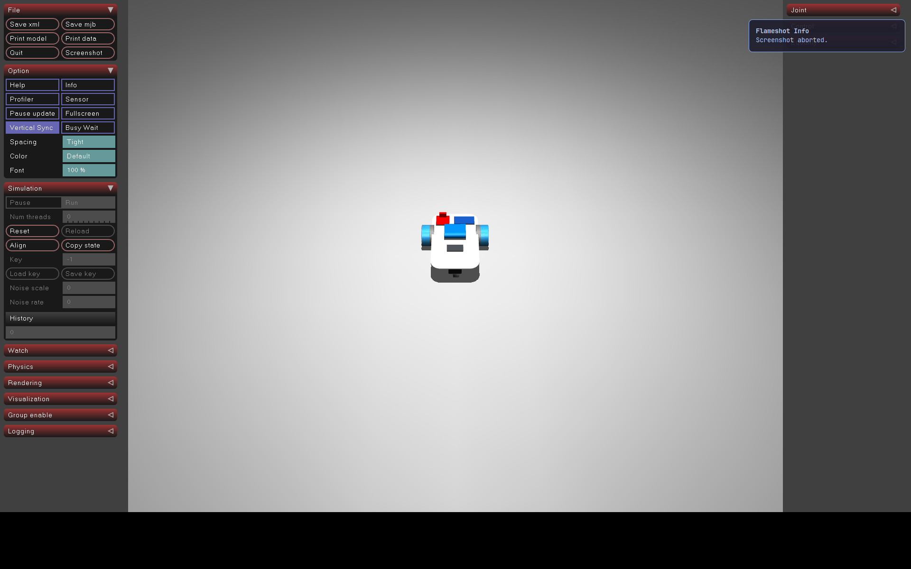

For these experiments, [`envs/line_scene.py`](../envs/line_scene.py) expands the
rover scene and generates tape from [`envs/tracks.py`](../envs/tracks.py) waypoints
in memory.
PID and PPO both use **0.0508 m tape width**; older standalone track assets use
0.03 m.
Circle, figure eight, and oval form the original closed-track benchmark.
Goomba was held out of DR training to test a new geometry.
The PID runner also supports an open S-curve, with unresolved endpoint behavior.

### Know where the implementation lives

| Location | Responsibility |
| --- | --- |
| [`envs/pid.py`](../envs/pid.py) | Classical controller and dark-pixel centroid detection. |
| [`envs/camera.py`](../envs/camera.py), [`envs/contract.py`](../envs/contract.py) | Camera features and the shared simulation/hardware policy interface. |
| [`envs/tasks/line_follower_ppo_env.py`](../envs/tasks/line_follower_ppo_env.py) | Gymnasium observations, rewards, progress, and episode outcomes. |
| [`envs/line_dynamics.py`](../envs/line_dynamics.py), [`envs/motor.py`](../envs/motor.py) | DR sampling and BAM/DC motor integration. |
| [`scripts/train_ppo.py`](../scripts/train_ppo.py) | SB3 PPO training, validation, checkpoints, TensorBoard, and W&B. |
| [`scripts/evaluate_ppo.py`](../scripts/evaluate_ppo.py) | Independent simulation metrics, trajectories, video, and 3D viewing. |
| [`rover_control/rl_rover.py`](../../rover_control/rl_rover.py) | Physical camera/encoder conversion, inference, recording, and motor commands. |
| [`rover_control/ppo_deployment.py`](../../rover_control/ppo_deployment.py) | Checkpoint-specific simulation evidence and deployment manifest. |

The core libraries are Gymnasium for the environment API, MuJoCo for simulation,
Stable-Baselines3 for PPO, BAM for actuator friction, and Weights & Biases for
experiment tracking.
The checked-in dependency files are the source of truth for versions.

## 2. Establish a PID baseline before training

Run this and the remaining simulation commands from `rover_mujoco`:

```bash
# Watch PID line following alongside the camera image used for steering.
cd rover_mujoco
uv run scripts/line_follower.py --track figure8 --camera

# Evaluate the baseline with fixed settings and fresh spawn perturbations.
MUJOCO_GL=egl uv run scripts/line_follower.py \
  --headless --track all --episodes 20 --seed 100
```

The controller uses the bottom 15% of a 64×64 RGB image, detects pixels with all
channels below 60, and estimates the normalized horizontal line centroid.
At least six dark pixels are required, and the controller distinguishes a
missing line from a centered one.
The default gains are `kp=2`, `ki=0`, and `kd=0.1`, with a 3 rad/s forward wheel
command and a 10 Hz control rate.
With zero integral gain, this is a PD setting of the PID controller.

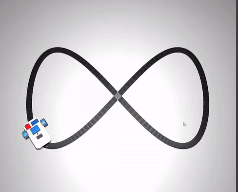

[Full PID simulation recording](vids/pid_figure8.mp4).
The camera overlay marks detected pixels and their centroid, making a controller
failure distinguishable from a perception failure.

| PID track | Completed | Mean chassis deviation | Maximum chassis deviation |
| --- | ---: | ---: | ---: |
| Circle | 20/20 | 2.23 cm | 2.69 cm |
| Figure eight | 20/20 | 1.84 cm | 5.01 cm |
| Oval | 20/20 | 1.97 cm | 4.07 cm |
| Open S-curve | 0/20 | 1.88 cm | 4.17 cm |

These trials used seeds 100–119 with up to 1 cm lateral and 5° heading offsets.
The S-curve failed near its endpoint: the forward camera ran out of tape before
the chassis reached the finish tolerance.
Its modest mean deviation therefore describes incomplete runs.
A zero-steering figure-eight control also failed, at about 5.6% progress.
The [PID guide](pid-line-follower.md) records the baseline protocol in detail.

PID established that the task was feasible, though PPO still needed enough
training to learn it.
We later verified the PPO action/observation interface by completing a
figure-eight lap with PID through that same interface.

### Read the baseline control loop

[`scripts/line_follower.py`](../scripts/line_follower.py) runs and evaluates PID;
PPO training belongs to [`scripts/train_ppo.py`](../scripts/train_ppo.py).
This excerpt from `run_episode` shows the reusable loop after scene setup,
settling, and controller initialization: observe the camera, handle missing
measurements, command steering, then advance the physics.

```python
# Read the camera and apply one PID command per control interval.
for step in range(math.ceil(args.duration / dt)):
    wall_start = time.monotonic()
    renderer.update_scene(data, camera="top_cam")
    frame = renderer.render()
    error, mask = centroid_error(frame)
    if step == 0:
        from PIL import Image

        Image.fromarray(camera_overlay(frame, error, mask)).save(output / f"camera_{seed}.png")
    missing = missing + 1 if error is None else 0
    if missing * dt >= 0.5:
        data.ctrl[:] = 0
        reason = "line_lost"
        break
    # Hold steering briefly across a dropout, resetting PID memory on reacquisition.
    correction = pid.update(error, dt)
    steering = last_steering if error is None else correction
    if args.controller == "bang_bang" and error is not None:
        steering = -3.0 * np.sign(error) if abs(error) > 0.05 else 0.0
    steering = float(np.clip(steering, -pid.limit, pid.limit))
    last_steering = steering
    data.ctrl[:] = [-args.speed + steering, args.speed + steering]
    mujoco.mj_step(model, data, nstep=substeps)  # ty: ignore[unresolved-attribute]
    mujoco.mj_forward(model, data)  # ty: ignore[unresolved-attribute]
```

The surrounding function initializes `pid`, `renderer`, `data`, and the episode
counters, then scores ordered progress and saves trajectories after these steps.
For a new task, establish a simple controller through the same sensing and
actuation path before asking RL to learn it; our PID comparison later helped
separate an insufficient PPO training budget from an unusable sensor interface.

## 3. Define the RL task and its success criteria

First require reliable lap completion, then compare speed and centering.
The policy receives only quantities available on hardware; rewards and
evaluation can use privileged simulator state.

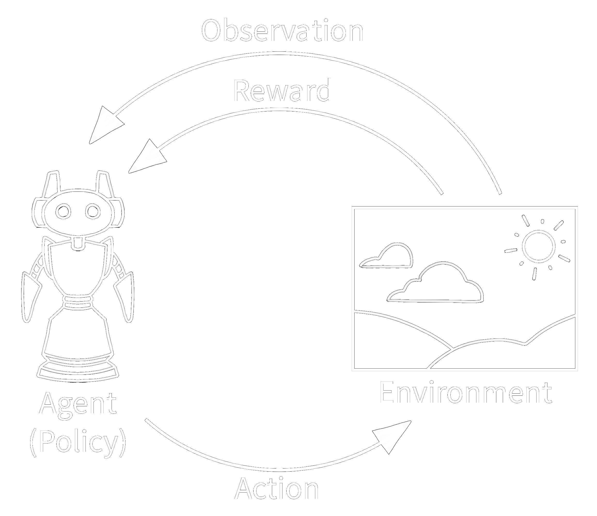

### Observation and action contract

`LineFollowerPPO-v0` receives an eleven-element `float32` observation in `[-1, 1]`:

| Indices | Meaning |
| --- | --- |
| 0–2 | Near camera band: centroid x, centroid y, visibility. |
| 3–5 | Middle camera band: centroid x, centroid y, visibility. |
| 6–8 | Far camera band: centroid x, centroid y, visibility. |
| 9–10 | Physical left/right wheel speed divided by 10 rad/s. |

The three camera bands span 85–100%, 55–85%, and 25–55% of image height.
No position, heading, waypoint index, or track identity enters the policy.
Both simulation and hardware call `observation_from_sensors`, so feature
extraction is shared.

Actions are normalized forward and steering commands:

```python
# Decode the normalized policy action to physical wheel targets in radians per second.
forward = 3.0 * (action[0] + 1.0)
steering = 4.0 * action[1]
left_target = forward - steering
right_target = forward + steering
```

Both physical wheel targets are positive forward.
Only MuJoCo negates the left target to match the CAD axle convention.
`[0, 0]` requests the PID's cruise speed and `[-1, 0]` requests a stop.
Physics advances at 2 ms, but the policy chooses an action every 100 ms.
The default camera has a 45° tilt and 60° vertical field of view.

### Reward guides learning; completion determines success

The selected nominal and DR runs use camera centering reward.
Forward progress is normalized by the distance expected at the PID cruise speed,
clipped to `[-2, 1]`, then multiplied by `0.25 + 0.75 * alignment` while the line
is visible.
Alignment uses the near-band centroid; the other bands are policy inputs for
preview, not separate weighted reward terms.
Missing-line observations earn a motion term of −1, action changes cost
`0.02 * sum((action - previous_action)**2)`, and every step costs 0.01.
Completion adds 10; terminated failures subtract 5, while a timeout is truncated
without that terminal penalty.

Stopping earns no positive centering reward, and high return alone does not
establish success.
The evaluator requires all of the following:

- Complete an ordered lap within the 3 cm finish tolerance.
- Keep chassis deviation at or below 6 cm.
- Avoid continuous line loss lasting 0.5 seconds.
- Avoid tipping below the environment's height threshold.
- Finish within 120 simulated seconds.

The 6 cm chassis-path tolerance extends beyond the tape's 2.54 cm half-width.

Progress projects onto nearby ordered track segments, preserving branch identity
through the figure-eight crossing.
Tipping, off-track motion, line loss, and completion are terminal outcomes;
the step limit is a truncation and still counts as an unsuccessful evaluation.
Keeping truncation separate allows value bootstrapping as described in
[Gymnasium's time-limit documentation](https://gymnasium.farama.org/tutorials/gymnasium_basics/handling_time_limits/).

### Build the Gymnasium environment

If you haven't built a Gymnasium environment before: it's just a Python class with a fixed
shape — a constructor, a `reset()` that starts an episode, and a `step()` that advances it one
tick and returns a reward — that's why the code below is split into lettered blocks (3a-3i)
instead of one long listing, one block per piece of that shape.

The following blocks assemble `LineFollowerPPOEnv` from
[`envs/tasks/line_follower_ppo_env.py`](../envs/tasks/line_follower_ppo_env.py),
using the existing scene, sensor, track, and motor helpers.
Together, blocks 3a–3h supply the complete class: keep 3a at module level, indent
methods from 3b–3e and 3h four spaces inside the class, and append 3f–3g eight
spaces inside `step` (the excerpts omit that enclosing indentation).
For a new task, create a separate module under `envs/tasks`, replace the geometry
and task-specific scoring, and preserve the reset, sensing, action, and episode lifecycle.

#### 3a. Declare the task and its dependencies

Import the shared helpers so scene construction and sensor conversion stay consistent
with the PID runner and hardware runtime.
The track registry defines which geometries this task accepts, while the constants
set the wheel units and optional reward blend; the reported policies use camera reward.

```python
# Share scene, sensor, and actuator helpers across control methods.
import math

import gymnasium as gym
from gymnasium import spaces
import mujoco
import numpy as np

from envs.contract import observation_from_sensors
from envs.contract import wheel_targets
from envs.line_dynamics import LineDynamics
from envs.line_scene import build_model
from envs.line_scene import CAM_RES
from envs.line_scene import CONTROL_HZ
from envs.tracks import circle_waypoints
from envs.tracks import figure8_waypoints
from envs.tracks import goomba_waypoints
from envs.tracks import oval_waypoints
from envs.tracks import path_length_table
from envs.tracks import project_arc_length

TRACKS = {
    "circle": circle_waypoints,
    "figure8": figure8_waypoints,
    "goomba": goomba_waypoints,
    "oval": oval_waypoints,
}

# Keep the optional blended reward reproducible alongside camera and chassis modes.
CHASSIS_SHARE = 0.2
WHEEL_RADIUS = 0.03435
CRUISE_RAD_S = 3.0
MAX_STEERING_RAD_S = 4.0
MAX_WHEEL_RAD_S = 10.0


class LineFollowerPPOEnv(gym.Env):
    """Observe camera features and wheel speeds; command forward speed and steering."""

    # Declare the supported render modes and policy frame rate for Gymnasium.
    metadata: dict = {"render_modes": ["rgb_array", "human"], "render_fps": 10}  # noqa: RUF012
```

#### 3b. Construct the simulator and spaces

Build the MuJoCo model once per environment and allocate its state and renderer.
The constructor exposes the eleven sensor inputs and two actions to Gymnasium,
then derives the physics substeps needed for a 10 Hz policy; a new task should
declare its own spaces here and keep them consistent with deployment.

```python
# Allocate the simulator and declare the policy interface once per environment.
def __init__(
    self,
    track="circle",
    random_start=False,
    render_mode=None,
    max_steps=1200,
    reward_centering="camera",
    dynamics="nominal",
    dr_ranges=None,
):
    super().__init__()
    if track not in TRACKS:
        raise ValueError(f"Unknown track {track!r}; choose from {list(TRACKS)}")
    self.track_name = track
    self.random_start = random_start
    self.render_mode = render_mode
    self.max_steps = max_steps
    if reward_centering not in ("camera", "chassis", "both"):
        raise ValueError("reward_centering must be 'camera', 'chassis' or 'both'")
    self.reward_centering = reward_centering
    self.points = np.asarray(TRACKS[track]())
    self.lengths, _ = path_length_table(self.points)
    if dynamics not in ("nominal", "bam", "dr"):
        raise ValueError("dynamics must be 'nominal', 'bam', or 'dr'")
    if dr_ranges is not None and dynamics != "dr":
        raise ValueError("dr_ranges requires dynamics='dr'")
    self.dynamics_mode = dynamics
    self.model = build_model(self.points, 45, bam=dynamics != "nominal")
    self.dynamics = LineDynamics(self.model, dynamics, dr_ranges) if dynamics != "nominal" else None
    # MuJoCo's compiled exports lack type stubs in this installation.
    self.data = mujoco.MjData(self.model)  # ty: ignore[unresolved-attribute]
    self.renderer = mujoco.Renderer(self.model, height=CAM_RES, width=CAM_RES)
    self.substeps = round(1 / CONTROL_HZ / self.model.opt.timestep)
    self.dt = self.substeps * self.model.opt.timestep
    self.axles = [self.model.joint(name).qposadr[0] for name in ("left_axle", "right_axle")]
    self.viewer = None
    # Nine camera features plus two signed wheel-speed estimates, all bounded by [-1, 1].
    self.observation_space = spaces.Box(-1, 1, shape=(11,), dtype=np.float32)
    self.action_space = spaces.Box(-1, 1, shape=(2,), dtype=np.float32)
    self.frame = np.zeros((CAM_RES, CAM_RES, 3), dtype=np.uint8)
```

#### 3c. Reset the world and episode memory

Use Gymnasium's seeded generator for spawn offsets and DR so a saved seed can
reproduce an episode.
After one second of settling, reset encoder history, progress, line-loss counters,
and reward state; for a new task, clear every variable that should not carry
information between episodes.

```python
# Start each episode from seeded conditions with cleared control and scoring history.
def reset(self, seed=None, options=None):
    super().reset(seed=seed)
    mujoco.mj_resetData(self.model, self.data)  # ty: ignore[unresolved-attribute]
    # Seed all physical and sensor perturbations with Gymnasium's episode generator.
    if self.dynamics is not None:
        self.dynamics.reset(self.np_random, self.data)
    segment = int(self.np_random.integers(len(self.points) - 1)) if self.random_start else 0
    tangent = self.points[segment + 1] - self.points[segment]
    tangent /= np.linalg.norm(tangent)
    lateral = self.np_random.uniform(-0.01, 0.01)
    yaw = math.atan2(tangent[0], -tangent[1]) + self.np_random.uniform(
        -math.radians(5), math.radians(5)
    )
    self.data.qpos[:2] = self.points[segment] + lateral * np.array([-tangent[1], tangent[0]])
    self.data.qpos[3:7] = [math.cos(yaw / 2), 0, 0, math.sin(yaw / 2)]
    # Settle before starting the episode, matching the classical-controller evaluation.
    if self.dynamics is None:
        mujoco.mj_step(self.model, self.data, nstep=round(1 / self.model.opt.timestep))  # ty: ignore[unresolved-attribute]
    else:
        self.dynamics.advance(
            self.data, np.zeros(2), round(1 / self.model.opt.timestep), settling=True
        )
    mujoco.mj_forward(self.model, self.data)  # ty: ignore[unresolved-attribute]
    self.previous_angles = self.data.qpos[self.axles].copy()
    self.wheel_speeds = np.zeros(2)
    self.previous_action = np.array([-1, 0], dtype=np.float32)
    self.arc, self.segment = project_arc_length(
        self.points, self.lengths, self.data.qpos[:2], segment, window=4, closed=True
    )
    self.progress = 0.0
    self.steps = 0
    self.lost_steps = 0
    self.total_lost = 0
    self.deviations = []
    self.episode_return = 0.0
    self.finished = False
    observation = self._get_observation()
    return observation, {
        "track": self.track_name,
        "dynamics": self.dynamics_mode,
        "domain_parameters": self.dynamics.parameters if self.dynamics else {},
    }
```

#### 3d. Build observations from deployable sensors

Render the camera and read wheel-speed estimates, then apply sensor perturbations
before feature extraction.
The shared `observation_from_sensors` helper calls `line_features`, flattens the
three camera bands, and appends wheel speeds clipped after division by 10;
replace those features for a new task only if its hardware can supply them.

```python
def _get_observation(self):
    # Camera pixels and finite differences of encoder angles are the only policy inputs.
    self.renderer.update_scene(self.data, camera="top_cam")
    self.frame = self.renderer.render().copy()
    speeds = self.wheel_speeds
    if self.dynamics is not None:
        self.frame, speeds = self.dynamics.sensors(self.frame, speeds)
    return observation_from_sensors(self.frame, speeds)
```

#### 3e. Apply an action and advance physical time

Begin `step` by decoding the policy action into physical wheel targets and
advancing one control interval through either velocity servos or BAM.
Wheel-angle differences over that interval provide encoder speed, and the
resulting observation and ordered path projection provide the inputs for
reward and episode scoring.

```python
# Advance one policy interval before observing and scoring its result.
def step(self, action):
    if self.finished:
        raise RuntimeError("Reset the environment after an episode ends")
    action = np.clip(np.asarray(action, dtype=np.float32), -1, 1)
    # CAD axle signs: forward motion is negative left and positive right.
    targets = wheel_targets(action)
    if self.dynamics is None:
        self.data.ctrl[:] = targets * [-1, 1]
        mujoco.mj_step(self.model, self.data, nstep=self.substeps)  # ty: ignore[unresolved-attribute]
    else:
        self.dynamics.advance(self.data, targets, self.substeps)
    mujoco.mj_forward(self.model, self.data)  # ty: ignore[unresolved-attribute]
    self.steps += 1
    angles = self.data.qpos[self.axles].copy()
    self.wheel_speeds = (angles - self.previous_angles) / self.dt * [-1, 1]
    self.previous_angles = angles
    observation = self._get_observation()
    delta, deviation = self._track_progress()
    self.deviations.append(deviation)
    visible = bool(observation[2])
    self.lost_steps = 0 if visible else self.lost_steps + 1
    self.total_lost += not visible
```

#### 3f. Calculate reward inside the same step

Continue inside `step` at the same indentation: reward forward progress while
encouraging centering and smooth commands.
Camera, chassis, and blended modes change only the reward, which lets us compare
shaping choices under the same physics and success criteria; for another task,
replace this calculation without hiding the outcome in the reward value.

```python
# Forward progress earns reward only while the line is visible; stopping earns no alignment.
progress_reward = float(np.clip(delta / (CRUISE_RAD_S * WHEEL_RADIUS * self.dt), -2, 1))
# Select the configured centering reward without changing observations or physics.
camera_error = abs(float(observation[0]))
chassis_error = min(deviation / 0.06, 1.0)
if self.reward_centering == "camera":
    error = camera_error
elif self.reward_centering == "chassis":
    error = chassis_error
else:
    error = (1 - CHASSIS_SHARE) * camera_error + CHASSIS_SHARE * chassis_error
alignment = 1 - error if visible else 0
motion_reward = progress_reward * (0.25 + 0.75 * alignment) if visible else -1.0
smoothness_penalty = 0.02 * float(np.sum((action - self.previous_action) ** 2))
reward = motion_reward - smoothness_penalty - 0.01
self.previous_action = action.copy()
```

#### 3g. Decide outcomes and return the transition

Finish `step` by checking failure and completion independently of reward, with
failures checked before completion when both occur on the same step.
Return Gymnasium's five values and put physical metrics in `info`; a timeout
is a truncation, while tipping, leaving the track, line loss, and completion
are terminal task outcomes.

```python
# Task outcomes are geometric and temporal, independent of the shaped reward.
reason = "running"
if self.data.qpos[2] < 0.03:
    reason = "tipped"
elif deviation > 0.06:
    reason = "off_track"
elif self.lost_steps * self.dt >= 0.5:
    reason = "line_lost"
elif self.progress >= self.lengths[-1] - 0.03:
    reason = "completed"
elif self.steps >= self.max_steps:
    reason = "timeout"
terminated = reason in ("tipped", "off_track", "line_lost", "completed")
truncated = reason == "timeout"
if terminated:
    reward += 10 if reason == "completed" else -5
self.finished = terminated or truncated
self.episode_return += reward
info = {
    "track": self.track_name,
    "is_success": reason == "completed",
    "reason": reason,
    "progress_fraction": float(self.progress / self.lengths[-1]),
    "deviation_cm": deviation * 100,
    "line_visible": visible,
    "reward_motion": motion_reward,
    "reward_smoothness": -smoothness_penalty,
}
if self.finished:
    info.update({
        "mean_deviation_cm": float(np.mean(self.deviations) * 100),
        "max_deviation_cm": float(np.max(self.deviations) * 100),
        "line_loss_frames": self.total_lost,
        "duration_s": self.steps * self.dt,
        "dynamics": self.dynamics_mode,
        "domain_parameters": self.dynamics.parameters if self.dynamics else {},
    })
if self.render_mode == "human":
    self.render()
return observation, float(reward), terminated, truncated, info
```

#### 3h. Track progress and release resources

For this task, local ordered projection prevents the figure-eight crossing
from counting as a jump to another branch; replace this helper with the progress
measure appropriate to your task.
The remaining methods support viewing and close the viewer and renderer, which
is necessary when training creates and destroys multiple environments.

```python
def _track_progress(self):
    # Local projection preserves branch identity through the figure-eight crossing.
    arc, self.segment = project_arc_length(
        self.points, self.lengths, self.data.qpos[:2], self.segment, window=4, closed=True
    )
    total = self.lengths[-1]
    delta = float((arc - self.arc + total / 2) % total - total / 2)
    self.arc = arc
    self.progress += delta
    fraction = (arc - self.lengths[self.segment]) / (
        self.lengths[self.segment + 1] - self.lengths[self.segment]
    )
    projection = self.points[self.segment] + fraction * (
        self.points[self.segment + 1] - self.points[self.segment]
    )
    return delta, float(np.linalg.norm(self.data.qpos[:2] - projection))


# Keep rendering optional and release the viewer and camera resources on close.
def render(self):
    if self.render_mode == "human":
        import mujoco.viewer

        if self.viewer is None:
            self.viewer = mujoco.viewer.launch_passive(self.model, self.data)
            self.viewer.cam.lookat[:] = [0, 0, 0]
            self.viewer.cam.distance = 2.8
            self.viewer.cam.elevation = -75
        if self.viewer.is_running():
            self.viewer.sync()
    return self.frame.copy()


def close(self):
    if self.viewer is not None:
        self.viewer.close()
    self.renderer.close()
```

#### 3i. Register and check the environment

The registry in [`envs/__init__.py`](../envs/__init__.py) maps a Gymnasium ID to
this class; importing `envs` performs that registration.
For a new task, add a distinct ID and module path, then check its API before
starting a long training run.

```python
from gymnasium.envs.registration import register

# Map the public environment ID to the module and class Gymnasium should construct.
register(
    id="LineFollowerPPO-v0",
    entry_point="envs.tasks.line_follower_ppo_env:LineFollowerPPOEnv",
)
```

Run this separate check from `rover_mujoco` with `MUJOCO_GL=egl` for headless
rendering; the existing package already registers the environment.
The checker validates the API and spaces, while the seeded transition confirms
that `reset` and `step` can run; use the project's tests to check task semantics.

```python
import envs  # noqa: F401
import gymnasium as gym
from stable_baselines3.common.env_checker import check_env

# Check the environment contract and one seeded transition before committing to training.
environment = gym.make("LineFollowerPPO-v0", track="figure8")
try:
    check_env(environment.unwrapped, warn=True)
    observation, info = environment.reset(seed=1000)
    action = environment.action_space.sample()
    observation, reward, terminated, truncated, info = environment.step(action)
    print(observation.shape, reward, terminated, truncated, info["reason"])
finally:
    environment.close()
```

## 4. Train and evaluate nominal PPO

### Run a new experiment

W&B logs to `rover-line-follower` by default.
Authenticate once and choose a fresh output directory.
Specify the original tracks so registering a new track cannot change the experiment.

```bash
# Authenticate the experiment tracker before starting a logged run.
uv run wandb login

# Train a new nominal policy on the three original closed tracks.
MUJOCO_GL=egl OMP_NUM_THREADS=1 OPENBLAS_NUM_THREADS=1 \
  uv run scripts/train_ppo.py --dynamics nominal --tracks circle figure8 oval \
  --timesteps 250000 --n-envs 6 --output runs/nominal-new

# Evaluate the selected checkpoint independently and save camera footage.
MUJOCO_GL=egl uv run scripts/evaluate_ppo.py runs/nominal-new/best_model.zip \
  --episodes 20 --seed 40000 --video --output runs/nominal-new/evaluation-fresh
```

The default PPO configuration uses a `[64, 64]` MLP, learning rate 0.0003,
512 steps per worker per rollout, batch size 256, ten optimization epochs,
gamma 0.995, GAE lambda 0.95, clipping range 0.2, and entropy coefficient 0.005.
Six workers distribute the three tracks evenly and sample training start
positions along each track.
During continuation, the incoming checkpoint remains eligible for selection
if further training performs worse.

Every 25,000 steps, validation uses five episodes per track, seeds 1000–1004.
Selection prioritizes the weakest track's completion rate, then mean validation
return; final tests use different seeds and deterministic policy actions.
This follows the principle of separate evaluation in the
[SB3 experiment guidance](https://stable-baselines3.readthedocs.io/en/master/guide/rl_tips.html).
Each run saves TensorBoard scalars, configurations, validation histories,
selected/final models, evaluation CSVs, plots, and videos for review.

### Connect the environment to PPO

The environment supplies transitions; `scripts/train_ppo.py` owns optimization,
checkpoint selection, and experiment logging.
The following excerpts belong to that existing runner and use its imports,
parsed `args`, resolved `dr_ranges`, and `hyperparameters`; they are not a
second standalone training script.

#### Create independent workers and initialize PPO

`make_environment` wraps each task in `Monitor`, and the worker factories assign
tracks round-robin while randomizing training start positions.
Inside `main`, `SubprocVecEnv` creates separate simulator processes and the runner
either constructs PPO or loads a checkpoint with the explicitly configured
hyperparameters; retain the runner's `if __name__ == "__main__"` guard when adapting
this multiprocessing structure.

```python
def make_environment(track, reward_centering, dynamics="nominal", dr_ranges=None) -> gym.Env:
    # Each worker has a fixed track and samples start positions along it at reset.
    return Monitor(
        gym.make(
            ENV_ID,
            track=track,
            random_start=True,
            reward_centering=reward_centering,
            dynamics=dynamics,
            dr_ranges=dr_ranges,
        )
    )
```

With the factory defined, the next block creates and seeds the workers inside
`main`.
Passing the same resolved hyperparameters to both branches keeps resumed
training consistent with the saved configuration.

```python
# Build independent simulator workers and apply the recorded PPO settings.
factories: list[Callable[[], gym.Env]] = [
    partial(
        make_environment,
        args.tracks[i % len(args.tracks)],
        args.reward_centering,
        args.dynamics,
        dr_ranges,
    )
    for i in range(args.n_envs)
]
environment = SubprocVecEnv(factories, start_method="spawn")
environment.seed(args.seed)
# Resumed policies use the same explicit hyperparameters recorded for this run.
if args.resume:
    model = PPO.load(
        args.resume,
        env=environment,
        device="cpu",
        seed=args.seed,
        tensorboard_log=str(args.output / "tensorboard"),
        **hyperparameters,
    )
else:
    model = PPO(
        "MlpPolicy",
        environment,
        device="cpu",
        seed=args.seed,
        verbose=0,
        tensorboard_log=str(args.output / "tensorboard"),
        **hyperparameters,
    )
```

#### Select checkpoints using completion

`CompletionCallback._evaluate` tests fixed validation seeds and ranks the
weakest track's completion rate before mean return, so easy tracks cannot hide
failure on the figure eight.
Its surrounding callback evaluates the incoming policy at training start and
repeats at the configured interval; for a new task, define the success metric
and selection rule before comparing candidates.

```python
# Preserve the strongest validation checkpoint and record every comparison.
def _evaluate(self):
    results = evaluate(
        self.model,
        episodes=self.episodes,
        seed=1000,
        reward_centering=self.reward_centering,
        tracks=self.tracks,
        dynamics=self.dynamics,
        dr_ranges=self.dr_ranges,
    )
    for track, result in results.items():
        for key in ("success_rate", "mean_return", "mean_deviation_cm", "mean_progress"):
            self.logger.record(f"eval/{track}/{key}", result[key])
    score = (
        min(result["success_rate"] for result in results.values()),
        float(np.mean([result["mean_return"] for result in results.values()])),
    )
    if score > self.best_score:
        self.best_score = score
        self.model.save(self.output / "best_model")
    self.history.append({"timesteps": self.num_timesteps, "tracks": results})
    (self.output / "validation.json").write_text(
        json.dumps(self.history, indent=2), encoding="utf-8"
    )
    self.logger.dump(self.num_timesteps)
    print(
        f"Validation at {self.num_timesteps}: "
        + ", ".join(f"{track}={result['success_rate']:.0%}" for track, result in results.items()),
        flush=True,
    )
```

The next block in `main` attaches that selection callback and periodic recovery
checkpoints before starting optimization.
`final_model` records the last update, while `best_model` records the selected
policy; the runner then reloads the latter for independent tests on seed 10000
onward, as described above.

```python
# Train with validation-based selection and periodic recovery checkpoints.
callbacks: list[BaseCallback] = [
    CompletionCallback(
        args.output,
        args.eval_every,
        args.eval_episodes,
        args.reward_centering,
        args.tracks,
        args.dynamics,
        dr_ranges,
    ),
    CheckpointCallback(
        save_freq=max(1, args.eval_every // args.n_envs),
        save_path=str(args.output / "checkpoints"),
    ),
]
model.learn(total_timesteps=args.timesteps, callback=callbacks)
model.save(args.output / "final_model")
if not (args.output / "best_model.zip").exists():
    model.save(args.output / "best_model")
```

#### Save the experiment context alongside its curves

Before worker creation, `main` writes `config.json` with the resolved task,
dynamics, DR ranges, and PPO settings, then initializes W&B as shown below.
TensorBoard synchronization carries the optimization and callback metrics to
W&B; after testing, the runner adds evaluation summaries, trajectories, and the
selected model artifact so a graph can be traced back to its configuration.

```python
# W&B is enabled by default and must initialize successfully before training starts.
if not args.no_wandb:
    import wandb

    run = wandb.init(
        project="rover-line-follower",
        name=args.output.name,
        group=args.wandb_group,
        config=config,
        sync_tensorboard=True,
        dir=str(args.output),
    )
    print(f"W&B: {run.url}", flush=True)
```

### What happened in our run

The initial nominal run stopped after roughly 52,000 interactions and failed the
figure eight around 8.5% progress, before the crossing.
After checking PID through the same interface, we resumed the 49,992-step
checkpoint to test whether PPO needed more training.
The camera-reward continuation requested 150,000 more steps, collected 150,528
because SB3 finishes whole rollouts, and selected a policy at 199,992 cumulative
interactions.

The selected `ppo-continued-seed0` policy first passed 20/20 episodes per track;
an expanded evaluation used seeds 10000–10039:

| Nominal PPO track | Completed | Mean chassis deviation | Maximum chassis deviation | Mean lap time |
| --- | ---: | ---: | ---: | ---: |
| Circle | 40/40 | 2.69 cm | 2.88 cm | 21.09 s |
| Figure eight | 40/40 | 2.08 cm | 5.68 cm | 42.29 s |
| Oval | 40/40 | 2.39 cm | 4.30 cm | 24.34 s |

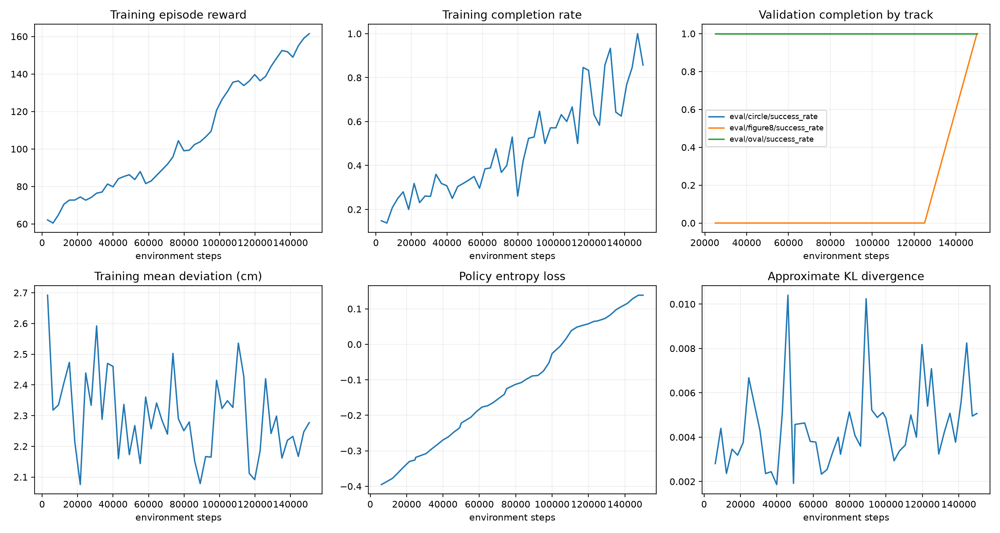

Figure 6 counts additional continuation steps, not the earlier 49,992 steps.
The next plot shows the original 20 episodes per track; the table above reports
the larger 40-episode rerun of the same checkpoint.

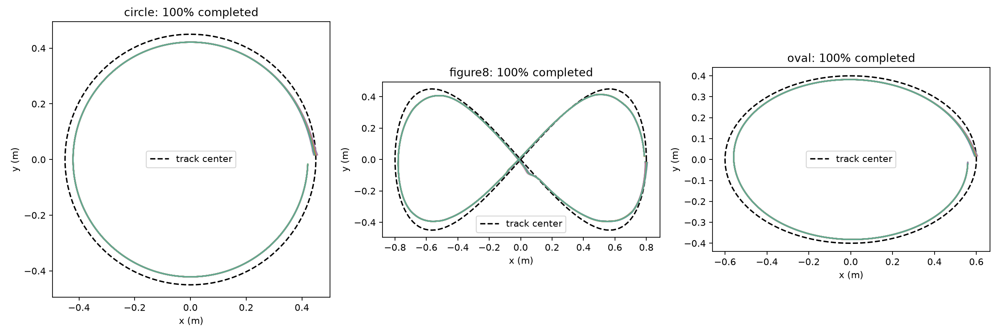

The [nominal W&B run](https://wandb.ai/cursedrock17-university-of-maryland/rover-line-follower/runs/hzl1xy2f)
and [expanded evaluation JSON](https://huggingface.co/CursedRock17/rover-line-follower-ppo/blob/77c0bf85aa4c0dd36ec0862fd17be485c1e686ac/backups/2026-09-10/runs/ppo-continued-seed0/evaluation-40/evaluation.json)
retain the supporting evidence.
Every original track exceeded the requested observed 90% completion rate in
nominal simulation, using one training seed.
The learned policy uses no PID demonstrations or PID fallback.

## 5. Compare rewards and sweep hyperparameters

We compared camera and chassis centering rewards by resuming the same original
checkpoint with the same additional budget.
Chassis centering reduced mean figure-eight deviation but completed only 4/20
episodes, versus 20/20 for camera centering.
Because that smaller error included early failures, we kept camera centering.

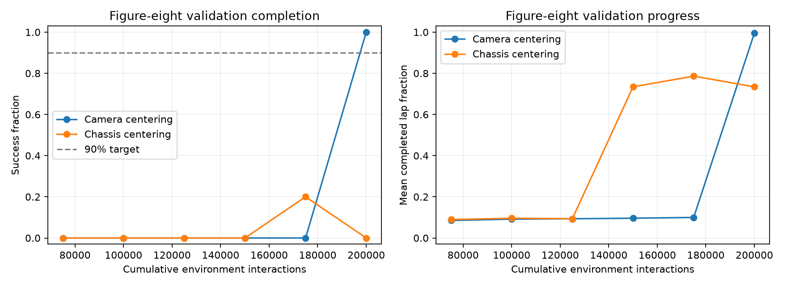

We then ran four continuations from the qualified camera-reward checkpoint,
changing one hyperparameter at a time, with frozen code/assets and the same
50,000-step request per candidate.
Each actually collected 52,224 steps.

| Candidate | Change | Selected additional step | Interpretation |
| --- | --- | ---: | --- |
| Reference | Keep the nominal settings. | 25,002 | Selected by the predefined validation score. |
| Learning rate | 0.0003 → 0.001 | 50,004 | Qualified on the common benchmark, without a clear accuracy gain. |
| Entropy | 0.005 → 0 | 0 | Later checkpoints regressed, so the original policy remained best. |
| Discount | 0.995 → 0.98 | 25,002 | Faster figure-eight laps with greater mean deviation. |

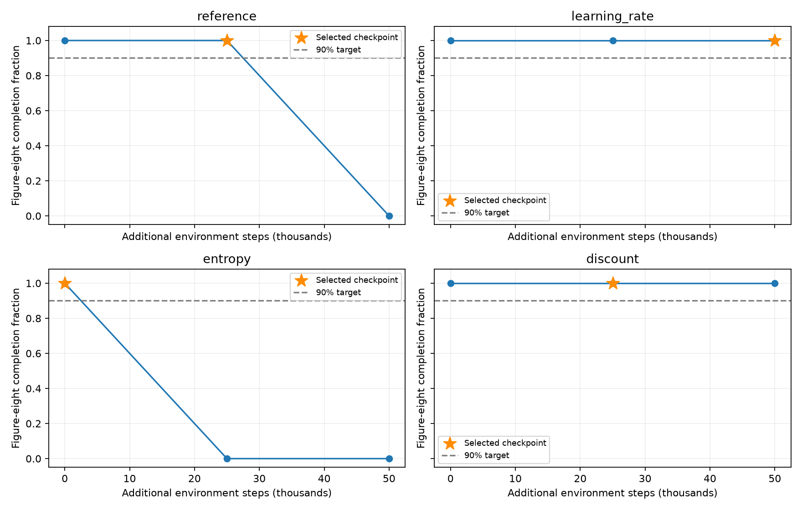

The reference winner completed 50/50 fresh episodes per original track on seeds
20000–20049.
The discount candidate's common-benchmark figure-eight mean lap was 39.32 s,
versus 42.28 s for the incoming nominal policy, while mean deviation increased
from about 2.08 to 2.32 cm.
The highest validation return did not identify the fastest or most accurate policy.
We used the original qualified nominal policy as the starting point for DR.
The [sweep report](ppo-hparam-sweep.md) and
[final sweep W&B evaluation](https://wandb.ai/cursedrock17-university-of-maryland/rover-line-follower/runs/g09tliwh)
record the full comparison and selected model.

## 6. Add BAM and domain randomization

The nominal policy failed the figure eight with more realistic actuators.
Five trials per track under fixed BAM and another five under randomized BAM
each produced 5/5 circle, **0/5 figure eight**, and 5/5 oval.
We fine-tuned under these dynamics to close the gap before deployment.

The environment exposes three modes without changing the policy's eleven-input,
two-action interface:

| Mode | Physical and sensor behavior |
| --- | --- |
| `nominal` | Original velocity servos and fixed simulation conditions. |
| `bam` | DC motor drive, BAM friction, and the hardware speed envelope with fixed parameters. |
| `dr` | BAM plus newly sampled dynamics and sensor perturbations on each reset. |

BAM models actuator friction.
At every physics substep, our integration computes voltage-limited drive torque
and electrical damping, then applies BAM's Coulomb/Stribeck/viscous friction to
the wheel joints.
Speed-dependent damping is handled implicitly to reproduce the tested motor
steady state at the scene's 2 ms timestep.
Both BAM modes zero targets below `0.075 / 0.03435 ≈ 2.183 rad/s` and clip them at
`0.25 / 0.03435 ≈ 7.278 rad/s` in magnitude.

The electrical and friction values are **provisional** and need bench identification:
`kt=0.10787315 Nm/A`, resistance `12 ohm`, and proportional speed-to-voltage gain
`6 V/(rad/s)`.
The stall-derived electrical model's predicted no-load speed differs from the
stated motor datasheet by about a factor of 2.3.
Successful transfer leaves that calibration work open;
[BAM's identification workflow](https://github.com/Rhoban/bam) requires recorded
motor-response data.

### Why we made these DR/BAM choices

The nominal policy's figure-eight failure under BAM motivated training with
actuator limits and uncertainty while keeping the policy interface fixed.
The table separates the reasons for those choices from the numerical ranges
below, which remain provisional engineering assumptions rather than fitted
measurements.

| Decision | Implementation | Reason and limit |
| --- | --- | --- |
| Keep a nominal baseline and a fixed-BAM mode. | `dynamics="nominal"`, `"bam"`, and `"dr"` select the actuator and sampling behavior. | Separate the effect of changing the actuator model from the effect of randomization. |
| Reuse the qualified nominal weights. | `--resume` loads the original camera-reward checkpoint before DR fine-tuning. | Start with an existing line-following behavior; the sweep winner was not the source of the reported DR policy. |
| Preserve the sensor/action contract. | All modes call `observation_from_sensors` and `wheel_targets`. | Attribute the comparison to dynamics and training while keeping the learned interface deployable. |
| Replace velocity servos with torque actuators. | `build_model(..., bam=True)` changes wheel actuators and `LineDynamics.advance` supplies motor drive. | Model the voltage and friction limits that an ideal velocity servo can hide. |
| Integrate electrical damping implicitly at every physics substep. | `motor_drive_and_damping` splits drive torque from damping, and `apply_friction` adds electrical and BAM damping. | The free-wheel test exposed incorrect steady-state behavior with explicit integration at the rover's small wheel inertia. |
| Train with the hardware command envelope. | `apply_actuator_envelope` uses the CAD radius to convert the firmware's linear speed limits. | Let PPO experience the dead zone and saturation during training; the limits still need physical calibration. |
| Sample persistent conditions once per episode. | `reset` uses Gymnasium's RNG, with independent left/right motor scales and shared chassis, camera, and supply parameters. | Model variation between runs and wheel mismatch without changing physical constants every control step. |
| Restore saved baselines before scaling. | Copy mass, inertia, and camera position in `__init__`, then assign from those copies in `reset`. | Prevent repeated resets from accumulating unintended model changes. |
| Change both sides of contact friction. | Set sliding friction on the model's contact geoms and refresh constants with `mj_setConst`. | Avoid the unchanged contact partner dominating MuJoCo's equal-priority friction combination. |
| Perturb pixels before extracting line features. | `sensors` applies brightness and Gaussian pixel noise, then the environment builds camera centroids. | Allow image quality to affect visibility as well as centroid position; encoder noise is added to wheel-speed estimates separately. |
| Model command delay with an episode-local queue. | Reset a zero-filled queue and delay targets by zero or one policy step. | Expose PPO to actuation lag without carrying commands across episodes; this does not model all hardware communication faults. |
| Record the sampled conditions and keep final seeds separate. | Save resolved ranges in `config.json` and per-episode `domain_parameters`, then evaluate the selected checkpoint on fresh seeds. | Make runs replayable and avoid selecting a model on its final test set; one training seed and these ranges do not establish universal robustness. |

### DR parameter table

Continuous parameters are sampled uniformly once per episode; motor scale
factors are independent for the two wheels, and command delay is a uniform
integer draw.
Pixel and encoder noise are sampled at each observation using the episode's
chosen Gaussian standard deviation.
Every evaluation episode records its sampled parameters.

| Parameter | Minimum | Maximum | Description |
| --- | ---: | ---: | --- |
| `mass_scale` | 0.9 | 1.1 | Scale CAD body masses and inertias by a common factor. |
| `contact_friction` | 0.6 | 1.2 | Set sliding friction on both sides of the ground contacts. |
| `voltage` | 10.8 V | 12.6 V | Set the shared motor supply voltage limit. |
| `kt_scale` | 0.9 | 1.1 | Scale each wheel's torque/back-EMF constant independently. |
| `resistance_scale` | 0.9 | 1.1 | Scale each wheel's electrical resistance independently. |
| `kp_scale` | 0.8 | 1.2 | Scale each wheel's speed-to-voltage gain independently. |
| `friction_scale` | 0.5 | 1.5 | Scale each wheel's BAM friction terms together. |
| `camera_x_m` | −0.003 m | 0.003 m | Shift the camera laterally from its nominal position. |
| `camera_y_m` | −0.003 m | 0.003 m | Shift the camera longitudinally from its nominal position. |
| `camera_z_m` | −0.002 m | 0.002 m | Shift the camera vertically from its nominal position. |
| `camera_tilt_deg` | 42° | 48° | Vary tilt around the nominal 45° mount. |
| `camera_fovy_deg` | 57° | 63° | Vary the vertical field of view around 60°. |
| `brightness` | 0.85 | 1.15 | Scale RGB intensity before extracting line features. |
| `pixel_noise_std` | 0 | 2 intensity levels | Set zero-mean Gaussian pixel-noise standard deviation. |
| `encoder_noise_std` | 0 rad/s | 0.1 rad/s | Set zero-mean Gaussian wheel-speed noise standard deviation. |
| `command_delay_steps` | 0 | 1 | Delay commands by zero or one 100 ms control step. |

Bounds are defined in `envs/line_dynamics.py` and saved in the run configuration.
`--dr-ranges ranges.json` can override selected bounds for another experiment;
use separate validation and fresh final seeds when tuning them.
The [DR/BAM guide](dr-bam-line-follower.md) explains sampling, reset restoration,
and the exact motor coupling.

### Implement the dynamics adapter

`LineFollowerPPOEnv` already calls `reset`, `advance`, and `sensors` on its optional
`LineDynamics` adapter, keeping the task's reward and success rules in the
environment class.
These excerpts from [`envs/line_dynamics.py`](../envs/line_dynamics.py) and
[`envs/line_scene.py`](../envs/line_scene.py) show how to implement that adapter;
retain their surrounding imports, range definitions, and validation helpers
when adapting the pattern.

#### Switch the scene to torque control

Inside `build_model`, replace velocity actuators only when BAM is selected;
remove the servo gain and its velocity command limits because the new controls
represent torque.
The dynamics adapter will apply the wheel-speed envelope before converting
targets to motor drive.

```python
# BAM supplies wheel torque directly and integrates its electrical damping separately.
if bam:
    for actuator in scene.findall("actuator/velocity"):
        actuator.tag = "motor"
        actuator.attrib.pop("kv")
        actuator.attrib.pop("ctrlrange")
        actuator.set("ctrllimited", "false")
```

#### Capture immutable baselines

The adapter constructor looks up the wheel degrees of freedom, actuators, and
camera once, then copies the physical values needed to restore each episode.
For a new robot, update these names and the parameters you intend to randomize;
the two friction models remain separate so the wheels can differ.

```python
# Capture the compiled baseline before any episode changes its parameters.
def __init__(self, model, mode, ranges=None):
    self.model = model
    self.mode = mode
    self.ranges = validate_ranges(ranges)
    self.dofs = np.array([model.joint(name).dofadr[0] for name in ("left_axle", "right_axle")])
    self.actuators = [model.actuator(name).id for name in ("left_wheel_motor", "right_wheel_motor")]
    self.camera = model.camera("top_cam")
    self.mass = model.body_mass.copy()
    self.inertia = model.body_inertia.copy()
    self.camera_pos = self.camera.pos.copy()
    self.frictions = [motor.make_friction_model(), motor.make_friction_model()]
```

#### Sample and apply one episode's parameters

At reset, draw from the resolved ranges using the environment's RNG, with two
values for each wheel-specific parameter and one for shared conditions.
Apply the draw to the saved baselines, update the motor constants, and clear
the command queue; fixed BAM follows this same path with nominal values so the
comparison does not require a second integration implementation.

```python
def reset(self, rng, data):
    # Draw independent motor properties but share chassis, camera, and supply parameters.
    self.rng = rng
    self.parameters = {}
    for key, (low, high) in self.ranges.items():
        size = 2 if key in WHEEL_PARAMETERS else None
        if self.mode == "dr":
            value = (
                rng.integers(low, high + 1)
                if key == "command_delay_steps"
                else rng.uniform(low, high, size=size)
            )
        else:
            value = np.full(2, NOMINAL[key]) if size else NOMINAL[key]
        self.parameters[key] = np.asarray(value).tolist()
    p = self.parameters
    # Restore absolute baselines before scaling so successive resets cannot accumulate drift.
    self.model.body_mass[:] = self.mass * p["mass_scale"]
    self.model.body_inertia[:] = self.inertia * p["mass_scale"]
    # Set both sides of every contact because MuJoCo mixes equal-priority friction by maximum.
    self.model.geom_friction[:, 0] = p["contact_friction"]
    self.camera.pos[:] = self.camera_pos + [p[f"camera_{axis}_m"] for axis in "xyz"]
    angle = math.radians(p["camera_tilt_deg"]) / 2
    self.camera.quat[:] = [0, 0, math.sin(angle), math.cos(angle)]
    self.camera.fovy[:] = p["camera_fovy_deg"]
    mujoco.mj_setConst(self.model, data)  # ty: ignore[unresolved-attribute]
    for index, friction in enumerate(self.frictions):
        scale = p["friction_scale"][index] * motor.STALL_TORQUE_OUTPUT_NM
        friction.friction_base.value = 0.1 * scale
        friction.friction_stribeck.value = 0.1 * scale
        friction.friction_viscous.value = 0.05 * scale
    self.electrical = {
        "vin": p["voltage"],
        "kt": motor.KT * np.array(p["kt_scale"]),
        "resistance": motor.R * np.array(p["resistance_scale"]),
        "kp": motor.VELOCITY_KP * np.array(p["kp_scale"]),
    }
    self.commands = deque(np.zeros(2) for _ in range(int(p["command_delay_steps"])))
```

#### Advance motors and perturb sensor measurements

`advance` applies the dead zone, speed ceiling, delay, and CAD wheel signs before
updating drive and damping on every MuJoCo substep.
`sensors` adds the episode's observation noise before the shared feature builder,
so dynamics and perception vary while the eleven-input policy contract stays fixed.

```python
def advance(self, data, wheel_targets, substeps, *, settling=False):
    # The firmware envelope is applied to physical wheel targets before the CAD sign change.
    targets = motor.apply_actuator_envelope(wheel_targets, MAX_WHEEL_RAD_S, MIN_WHEEL_RAD_S)
    if not settling:
        self.commands.append(targets.copy())
        targets = self.commands.popleft()
    targets = targets * [-1, 1]
    for _ in range(substeps):
        speeds = data.qvel[self.dofs]
        drive, damping = motor.motor_drive_and_damping(targets, speeds, **self.electrical)
        for index, friction in enumerate(self.frictions):
            motor.apply_friction(
                friction, self.model, self.dofs[index], speeds[index], damping[index]
            )
        data.ctrl[self.actuators] = drive
        mujoco.mj_step(self.model, data)  # ty: ignore[unresolved-attribute]


def sensors(self, frame, speeds):
    # Corrupt pixels before feature extraction so line visibility responds to image quality.
    p = self.parameters
    if p["brightness"] != 1 or p["pixel_noise_std"]:
        pixels = frame.astype(float) * p["brightness"]
        pixels += self.rng.normal(0, p["pixel_noise_std"], frame.shape)
        frame = np.clip(pixels, 0, 255).astype(np.uint8)
    if p["encoder_noise_std"]:
        speeds = speeds + self.rng.normal(0, p["encoder_noise_std"], 2)
    return frame, speeds
```

For another task, use the same separation: sample persistent physical conditions
at reset, integrate the actuator at the physics rate, and perturb measurements
where sensors enter the policy.
Keep a fixed-parameter comparison and tests for seeded replay, actuator behavior,
and task outcomes before widening the ranges or tuning against validation results.

### Train the DR policy

Download the nominal checkpoint first if it is not available locally; the
[download instructions](policy-downloads.md) preserve its matching configuration.
The run below assumes the original `runs/ppo-continued-seed0` location.

```bash
# Fine-tune the qualified nominal weights with randomized BAM dynamics.
MUJOCO_GL=egl OMP_NUM_THREADS=1 OPENBLAS_NUM_THREADS=1 \
  uv run scripts/train_ppo.py \
  --resume runs/ppo-continued-seed0/best_model.zip \
  --dynamics dr --tracks circle figure8 oval --timesteps 100000 \
  --eval-episodes 5 --test-episodes 20 \
  --wandb-group dr-bam-bringup --output runs/dr-new
```

The recorded run, `dr-bam-bringup/ppo-dr-seed0`, requested 100,000 additional steps
and collected 101,376; its best checkpoint was selected at 100,002 additional
steps.
It retained the nominal PPO hyperparameters and camera reward.
Figure-eight validation moved from 0/5 initially to 3/5, 1/5, 2/5, then 5/5 at
the successive 25,000-step evaluations.
The reversals show why checkpoint selection matters.

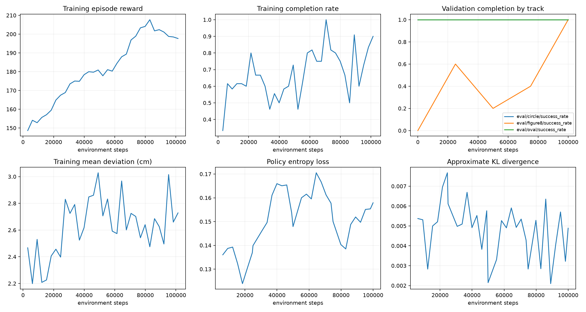

The first independent DR test passed 20/20 per original track on seeds
10000–10019.
The [DR training W&B run](https://wandb.ai/cursedrock17-university-of-maryland/rover-line-follower/runs/dc0dldgt)
contains the hyperparameters, optimization curves, validation history, and model
artifact.

## 7. Evaluate fresh randomized conditions and an unseen track

After freezing the selected policy, we tested fresh seeds 40000 onward on the
original tracks and 50000–50019 on Goomba, with no further checkpoint selection.

| Test conditions | Track | Completed | Mean deviation | Maximum deviation | Mean lap time |
| --- | --- | ---: | ---: | ---: | ---: |
| Fixed BAM | Circle | 20/20 | 3.14 cm | 3.34 cm | 23.98 s |
| Fixed BAM | Figure eight | 20/20 | 1.85 cm | 5.25 cm | 46.54 s |
| Fixed BAM | Oval | 20/20 | 2.72 cm | 4.45 cm | 27.44 s |
| Randomized BAM | Circle | 50/50 | 3.16 cm | 4.30 cm | 24.18 s |
| Randomized BAM | Figure eight | 50/50 | 1.90 cm | 5.80 cm | 46.90 s |
| Randomized BAM | Oval | 50/50 | 2.74 cm | 5.59 cm | 27.70 s |
| Randomized BAM, unseen geometry | Goomba | 20/20 | 1.92 cm | 4.25 cm | 32.09 s |

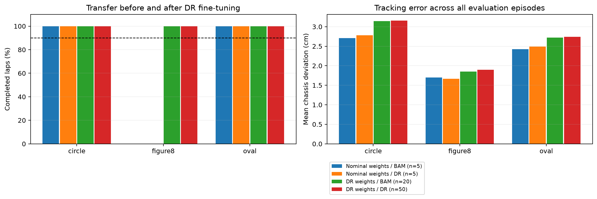

The pre-training figure-eight episodes stop early, which lowers their mean
error without demonstrating full-lap tracking.
The DR policy completes laps under the harder dynamics, but takes longer than
the nominal reference.

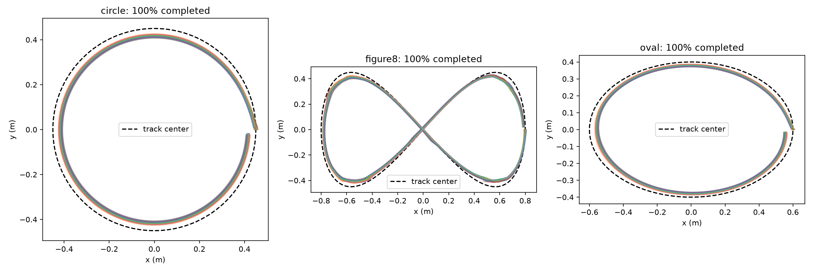

Both nominal and DR policies exceeded the required observed 90% completion rate
on each original track before hardware rollout.
Goomba tests a new geometry; DR tests the sampled distribution of surfaces,
lighting, and actuators, with no claim of coverage beyond those bounds.
The [qualification W&B run](https://wandb.ai/cursedrock17-university-of-maryland/rover-line-follower/runs/9mh560zs)
and [archived comparison metrics](https://huggingface.co/CursedRock17/rover-line-follower-ppo/blob/77c0bf85aa4c0dd36ec0862fd17be485c1e686ac/backups/2026-09-10/runs/dr-bam-bringup/summary.json)
contain the final results.
[DR figure-eight camera footage](https://huggingface.co/CursedRock17/rover-line-follower-ppo/blob/77c0bf85aa4c0dd36ec0862fd17be485c1e686ac/backups/2026-09-10/runs/dr-bam-bringup/ppo-dr-seed0/evaluation/figure8_camera.mp4)
comes from the earlier 20-episode independent test.

## 8. Deploy the selected policy on the physical rover

The selected DR/BAM policy successfully followed the line on the physical rover,
as reported by the experimenter.
The hardware runner uses the same weights and sensor/action conversion, adding
camera transport, firmware unit conversion, and stop handling.

### What changed at the hardware boundary

Encoder counts are converted to rad/s using the actual time between readings.
The current firmware-profile defaults in `rover_control/rover.py` are **680 counts
per wheel revolution** and signs **`(1, 1)`**; override them for a different firmware
profile or measured calibration.
Physical wheel commands are converted to metres per second before transmission.
The runner supports `--rover-addr`, `--camera-addr`, and `--record` for each setup.

The initial 250 ms sensor-age limit stopped runs during camera latency spikes.
The current runner polls the camera at 12.5 Hz while inference stays at 10 Hz,
uses a 1.0 s sensor-age limit, and permits 15 consecutive missing-line observations
before stopping, or 1.5 s at the control rate.
Simulation still fails after 0.5 s of continuous line loss.
These deployment settings leave the trained checkpoint and simulation success
criteria unchanged.
At the 0.25 m/s command ceiling, the hardware line-loss allowance corresponds to
up to 0.375 m of commanded travel before that stop condition fires.

### Run with the saved qualification evidence

The offline gate checks the exact DR checkpoint against fixed-BAM and DR tests,
and the nominal reference against its nominal tests, requiring at least 20
unique evaluation seeds and 90% completion on every original track.
Its saved manifest is
[`dr-bam-bringup/deployment.json`](https://huggingface.co/CursedRock17/rover-line-follower-ppo/blob/77c0bf85aa4c0dd36ec0862fd17be485c1e686ac/backups/2026-09-10/runs/dr-bam-bringup/deployment.json).
The [DR/BAM deployment section](dr-bam-line-follower.md#preparing-physical-rollout)
shows how to regenerate it from saved episode outcomes.

Run the physical entry point from the **workspace root**, using the actual network
addresses and a fresh recording directory:

```bash
# Run the qualified local policy and record the camera observations used by inference.
uv run python -m rover_control.examples.rl_line_follower \
  rover_mujoco/runs/dr-bam-bringup/ppo-dr-seed0/best_model.zip \
  rover_mujoco/runs/dr-bam-bringup/deployment.json \
  --rover-addr ROVER_IP --camera-addr http://CAMERA_IP/capture \
  --record rover_mujoco/artifacts/hardware/new-run
```

When restoring from HF, substitute the downloaded model and manifest paths.
`--record` produces `camera.mp4` with detection overlays and `observations.csv`
with the eleven policy inputs and sensor ages.
The loop commands zero during sensor startup and stops on sensor failures,
continued line loss, inference errors, or keyboard interruption.
Use an external video to document the rover's physical path; the onboard
recording shows only the policy's view.

The hardware footage and run conditions still need a shareable link in this
record.
Physical lap counts and chassis-deviation measurements are not documented here.

## 9. Recover the models and reproduce the figures

The selected DR model is `dr-bam-bringup/ppo-dr-seed0/best_model.zip`, SHA-256
`06f837b4cfafbd756c62ae0f97875e6832431da1616b3c2006a64d5fbb2d01bf`.
The original nominal reference has SHA-256
`dacac1b410f81761eb782ded8157800394b88e736410055937143812d61bee16`.
The HF archive contains all 66 policy/checkpoint files found at backup time.
Some historical policies, including the root `model.zip`, use older interfaces;
use the selected paths in this guide.

From `rover_mujoco`, download the DR checkpoint and matching configuration at the
verified immutable backup revision, then open it in the viewer:

```bash
# Download the checkpoint and configuration together to preserve the DR evaluation settings.
HF_POLICY_SUBDIR=backups/2026-09-10/runs/dr-bam-bringup/ppo-dr-seed0
uv run hf download CursedRock17/rover-line-follower-ppo \
  "$HF_POLICY_SUBDIR/best_model.zip" "$HF_POLICY_SUBDIR/config.json" \
  --revision 77c0bf85aa4c0dd36ec0862fd17be485c1e686ac --local-dir runs/hf

# View one randomized figure-eight episode using the recovered configuration.
MUJOCO_GL=glfw uv run scripts/evaluate_ppo.py \
  "runs/hf/$HF_POLICY_SUBDIR/best_model.zip" \
  --tracks figure8 --episodes 1 --seed 40000 --viewer
```

For physical execution, download `backups/2026-09-10/runs/dr-bam-bringup/deployment.json`
at the same revision as well.
The [download guide](policy-downloads.md) includes nominal and sweep checkpoints,
Python loading, caching, and offline reuse.

Training plots are exported from the TensorBoard scalars mirrored to W&B:

```bash
# Export unsmoothed learning curves and their numerical values from a restored training run.
uv run scripts/plot_ppo_training.py runs/dr-bam-bringup/ppo-dr-seed0
```

Download the full run folder for its TensorBoard event files; the model and
configuration alone cannot reproduce training plots.
Final evaluation saves trajectory CSVs and plots of the rover's motion.
The backup includes these artifacts, a checksum manifest, and frozen snapshots
of the training code and assets.

## 10. Verify the project before publishing changes

The regression tests exercise PID feasibility, perception, episode semantics,
PPO serialization and continuation, DR seed replay, actual contact friction,
motor integration, encoder units, and offline deployment rejection/stop paths.
Run them from `rover_mujoco`, then run the repository checks from the workspace
root:

```bash
# Verify the simulation and deployment interfaces without contacting the physical rover.
MUJOCO_GL=egl OMP_NUM_THREADS=1 OPENBLAS_NUM_THREADS=1 uv run python -m pytest tests -q

# Check repository formatting, lint, and types before committing changes.
cd ..
uv run scripts/check.py
```

Keep code, documentation, and selected report figures in GitHub; keep generated
run directories, local recordings, credentials, and caches out of Git.
The HF archive holds model weights and experiment artifacts, while the W&B links
retain the training and evaluation views.
