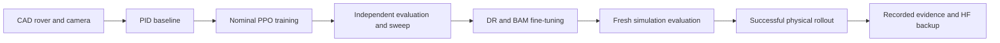

# Deploying a Mini Claw Rover Policy: Zero to Hero

We started with a custom CAD rover and a camera-based PID line follower, trained
PPO in MuJoCo, evaluated it independently, added domain randomization (DR) and
Better Actuator Models (BAM), and deployed the resulting policy on the physical
rover, where it successfully followed the line.
This guide walks through that complete experiment, including the failures that
shaped it, the recorded simulation results, and the hardware integration.

The models and experiment artifacts are preserved in a
[dated Hugging Face backup](https://huggingface.co/CursedRock17/rover-line-follower-ppo/tree/main/backups/2026-09-10).
That repository is private, so downloading its files requires an authorized HF
account; the figures below are stored in this Git repository for direct viewing.



| Stage | What it established | Recorded result |
| --- | --- | --- |
| PID | The camera, rover geometry, and control rate support the task. | 20/20 on each original closed track. |
| Nominal PPO | A learned policy can solve the same task without a PID fallback. | 40/40 per original track in the expanded evaluation. |
| Nominal sweep | Controlled continuations expose accuracy and speed tradeoffs. | Selected continuation: 50/50 per original track. |
| DR/BAM | PPO can adapt to motor limits and sampled physical/sensor variation. | 50/50 per original track under DR; 20/20 on unseen Goomba. |
| Physical rover | The selected DR policy transfers to the real line-following task. | Successful hardware operation, reported by the experimenter. |

The episode counts in this guide are simulation measurements; the hardware
milestone is a successful physical demonstration, not a measured 90% hardware
success rate across those simulation seeds.

## 1. Set up the rover and workspace

### Hardware and software

Use an assembled Mini Claw Rover, its ESP32 camera, a USB data cable for flashing,
and a computer that can communicate with both devices.
The Python workspace requires **Python 3.12**, as declared in both project
`pyproject.toml` files, and uses `uv` to manage dependencies.
VSCode with PlatformIO is useful for firmware work; a GPU is not required for
these small PPO policies.

The shell examples below use Bash syntax on Linux.
Desktop viewer commands need a graphical session, while `MUJOCO_GL=egl` selects
headless camera rendering on supported Linux systems.
For other platforms and package variants, follow the
[workspace setup guide](workspace-setup.md).

```bash
# Clone the firmware and application repositories into one workspace.
mkdir -p ~/Documents/mini_claw_ws
cd ~/Documents/mini_claw_ws
git clone https://github.com/wmala2/rover-firmware.git
git clone https://github.com/wmala2/rover_camera_firmware.git
git clone https://github.com/CursedRock17/matrix_lab_rover_above.git

# Install the CPU workspace and open the CAD rover in MuJoCo.
cd matrix_lab_rover_above
uv sync --extra cpu
uv run rover_mujoco/scripts/teleop_rover.py
```

Use the repository revision containing the line-follower code described here;
the HF backup separately pins the policy weights and available training snapshots.

### Flash the rover and camera

Skip flashing if both boards already run the intended firmware.
Otherwise, open the workspace in VSCode, install PlatformIO IDE, and select the
firmware project through its `platformio.ini` file.
Set Wi-Fi credentials in the firmware's local configuration and use addresses
appropriate for your network.
The companion firmware repositories document their board and network settings.


Run **PlatformIO: Build**, then **PlatformIO: Upload** with the rover connected by
USB; repeat for the camera firmware and camera board.
Verify the rover address and camera capture endpoint after flashing.


### Understand the simulation assets

The custom rover lives in [`assets/robots/rover`](../assets/robots/rover).
The renderer uses the CAD appearance, while collision geometry and joint inertias
control how it moves.
The [CAD-to-MJCF guide](onshape-to-robot-mjcf.md) covers OnShape export, collision
shapes, joint axes, and the track-mesh workflow.


For these experiments, [`envs/line_scene.py`](../envs/line_scene.py) expands the
rover scene and generates tape from [`envs/tracks.py`](../envs/tracks.py) waypoints
in memory.
PID and current PPO both use **0.0508 m tape width**, avoiding the mismatch with
older standalone 0.03 m track assets.
Circle, figure eight, and oval are the original closed-track benchmark;
Goomba was added as another geometry and held out of the reported DR training.
The PID runner also has an open S-curve, whose endpoint behavior remains a
separate problem.

### Know where the implementation lives

| Location | Responsibility |
| --- | --- |
| [`envs/pid.py`](../envs/pid.py) | Classical controller and dark-pixel centroid detection. |
| [`envs/camera.py`](../envs/camera.py), [`envs/contract.py`](../envs/contract.py) | Camera features and the shared simulation/hardware policy interface. |
| [`envs/tasks/line_follower_ppo_env.py`](../envs/tasks/line_follower_ppo_env.py) | Gymnasium observations, rewards, progress, and episode outcomes. |
| [`envs/line_dynamics.py`](../envs/line_dynamics.py), [`envs/motor.py`](../envs/motor.py) | DR sampling and BAM/DC motor integration. |
| [`scripts/train_ppo.py`](../scripts/train_ppo.py) | SB3 PPO training, validation, checkpoints, TensorBoard, and W&B. |
| [`scripts/evaluate_ppo.py`](../scripts/evaluate_ppo.py) | Independent simulation metrics, trajectories, video, and 3D viewing. |
| [`rover_control/rl_rover.py`](../../rover_control/rl_rover.py) | Physical camera/encoder conversion, inference, recording, and motor commands. |
| [`rover_control/ppo_deployment.py`](../../rover_control/ppo_deployment.py) | Checkpoint-specific simulation evidence and deployment manifest. |

The core libraries are Gymnasium for the environment API, MuJoCo for simulation,
Stable-Baselines3 for PPO, BAM for actuator friction, and Weights & Biases for
experiment tracking.
The checked-in dependency files are the source of truth for versions.

## 2. Establish a PID baseline before training

From this point through the simulation sections, run commands from `rover_mujoco`:

```bash
# Watch PID line following alongside the camera image used for steering.
cd rover_mujoco
uv run scripts/line_follower.py --track figure8 --camera

# Evaluate the baseline with fixed settings and fresh spawn perturbations.
MUJOCO_GL=egl uv run scripts/line_follower.py \
  --headless --track all --episodes 20 --seed 100
```

The controller uses the bottom 15% of a 64×64 RGB image, detects pixels with all
channels below 60, and estimates the normalized horizontal line centroid.
At least six dark pixels are required; a missing line is different from a
centered line.
The default gains are `kp=2`, `ki=0`, and `kd=0.1`, with a 3 rad/s forward wheel
command and a 10 Hz control rate.
This is a PD setting of the PID controller, with integral action available when
needed.


[Full PID simulation recording](vids/pid_figure8.mp4).
The camera overlay marks detected pixels and their centroid, making a controller
failure distinguishable from a perception failure.

| PID track | Completed | Mean chassis deviation | Maximum chassis deviation |
| --- | ---: | ---: | ---: |
| Circle | 20/20 | 2.23 cm | 2.69 cm |
| Figure eight | 20/20 | 1.84 cm | 5.01 cm |
| Oval | 20/20 | 1.97 cm | 4.07 cm |
| Open S-curve | 0/20 | 1.88 cm | 4.17 cm |

These trials used seeds 100–119 with up to 1 cm lateral and 5° heading offsets.
The S-curve failures occurred near the endpoint because the forward camera ran
out of tape before the chassis reached the finish tolerance; those episodes
remain failures despite their modest mean deviation.
A zero-steering figure-eight control also failed, at about 5.6% progress.
The [PID guide](pid-line-follower.md) records the baseline protocol in detail.

PID establishes feasibility, not a guarantee that PPO will learn the behavior in
an arbitrary training budget.
We later ran PID through the exact PPO action/observation interface and completed
a figure-eight lap, checking that the interface itself was sufficient.

## 3. Define the RL task and its success criteria

The objective is to complete a line-following lap reliably, then examine speed
and centering among policies that complete it.
The rover observes only quantities available on hardware; privileged simulator
state is reserved for rewards and evaluation.


### Observation and action contract

The registered environment is `LineFollowerPPO-v0`.
Its observation is an eleven-element `float32` vector bounded by `[-1, 1]`:

| Indices | Meaning |
| --- | --- |
| 0–2 | Near camera band: centroid x, centroid y, visibility. |
| 3–5 | Middle camera band: centroid x, centroid y, visibility. |
| 6–8 | Far camera band: centroid x, centroid y, visibility. |
| 9–10 | Physical left/right wheel speed divided by 10 rad/s. |

The three camera bands span 85–100%, 55–85%, and 25–55% of image height.
No position, heading, waypoint index, or track identity enters the policy.
Both simulation and hardware call `observation_from_sensors`, so feature
extraction is shared.

Actions are normalized forward and steering commands:

```python
# Decode the normalized policy action to physical wheel targets in radians per second.
forward = 3.0 * (action[0] + 1.0)
steering = 4.0 * action[1]
left_target = forward - steering
right_target = forward + steering
```

Both physical wheel targets are positive forward.
Only MuJoCo negates the left target to match the CAD axle convention.
`[0, 0]` requests the PID's cruise speed and `[-1, 0]` requests a stop.
Physics advances at 2 ms, but the policy chooses an action every 100 ms.
The default camera has a 45° tilt and 60° vertical field of view.

### Reward guides learning; completion determines success

The selected nominal and DR runs use camera centering reward.
Forward progress is normalized by the distance expected at the PID cruise speed,
clipped to `[-2, 1]`, then multiplied by `0.25 + 0.75 * alignment` while the line
is visible.
Alignment uses the near-band centroid; the other bands are policy inputs for
preview, not separate weighted reward terms.
Missing-line observations earn a motion term of −1, action changes cost
`0.02 * sum((action - previous_action)**2)`, and every step costs 0.01.
Completion adds 10; terminated failures subtract 5, while a timeout is truncated
without that terminal penalty.

Stopping therefore cannot collect a positive centering reward.
However, a large shaped return is still not proof of task completion.
The evaluator requires an ordered lap within the 3 cm finish tolerance, no
chassis deviation above 6 cm, no continuous line loss lasting 0.5 seconds, no
tipping below the environment's height threshold, and completion within
120 simulated seconds.
The 6 cm tolerance is a chassis-path criterion, not a claim that the chassis
origin stays inside the tape's 2.54 cm half-width.

Progress projects onto nearby ordered track segments, preserving branch identity
through the figure-eight crossing.
Tipping, off-track motion, line loss, and completion are terminal outcomes;
the step limit is a truncation and still counts as an unsuccessful evaluation.
Keeping truncation separate allows value bootstrapping as described in
[Gymnasium's time-limit documentation](https://gymnasium.farama.org/tutorials/gymnasium_basics/handling_time_limits/).

## 4. Train and evaluate nominal PPO

### Run a new experiment

W&B is enabled by default, with project `rover-line-follower`.
Authenticate once, choose a fresh output directory, and keep the original track
set explicit so newly registered tracks do not change the experiment.

```bash
# Authenticate the experiment tracker before starting a logged run.
uv run wandb login

# Train a new nominal policy on the three original closed tracks.
MUJOCO_GL=egl OMP_NUM_THREADS=1 OPENBLAS_NUM_THREADS=1 \
  uv run scripts/train_ppo.py --dynamics nominal --tracks circle figure8 oval \
  --timesteps 250000 --n-envs 6 --output runs/nominal-new

# Evaluate the selected checkpoint independently and save camera footage.
MUJOCO_GL=egl uv run scripts/evaluate_ppo.py runs/nominal-new/best_model.zip \
  --episodes 20 --seed 40000 --video --output runs/nominal-new/evaluation-fresh
```

The default PPO configuration uses a `[64, 64]` MLP, learning rate 0.0003,
512 steps per worker per rollout, batch size 256, ten optimization epochs,
gamma 0.995, GAE lambda 0.95, clipping range 0.2, and entropy coefficient 0.005.
Six workers distribute the three tracks evenly and sample training start
positions along each track.
The incoming checkpoint is eligible during continuation, so worse fine-tuning
cannot automatically replace it as the selected model.

Every 25,000 steps, validation uses five episodes per track, seeds 1000–1004.
Selection prioritizes the weakest track's completion rate, then mean validation
return; final tests use different seeds and deterministic policy actions.
This follows the principle of separate evaluation in the
[SB3 experiment guidance](https://stable-baselines3.readthedocs.io/en/master/guide/rl_tips.html).
TensorBoard scalars, configurations, validation histories, selected/final models,
evaluation CSVs, plots, and videos make the decision inspectable afterward.

### What happened in our run

The initial nominal run stopped after roughly 52,000 interactions and failed the
figure eight around 8.5% progress, before the crossing.
Rather than concluding that the sensors were insufficient, we compared against
PID through the same interface and resumed the 49,992-step checkpoint.
The camera-reward continuation requested 150,000 more steps, collected 150,528
because SB3 finishes whole rollouts, and selected a policy at 199,992 cumulative
interactions.

The selected `ppo-continued-seed0` policy first passed 20/20 episodes per track;
an expanded evaluation used seeds 10000–10039:

| Nominal PPO track | Completed | Mean chassis deviation | Maximum chassis deviation | Mean lap time |
| --- | ---: | ---: | ---: | ---: |
| Circle | 40/40 | 2.69 cm | 2.88 cm | 21.09 s |
| Figure eight | 40/40 | 2.08 cm | 5.68 cm | 42.29 s |
| Oval | 40/40 | 2.39 cm | 4.30 cm | 24.34 s |


Figure 6 counts additional continuation steps, not the earlier 49,992 steps.
The next plot shows the original 20 episodes per track; the table above reports
the larger 40-episode rerun of the same checkpoint.


The [nominal W&B run](https://wandb.ai/cursedrock17-university-of-maryland/rover-line-follower/runs/hzl1xy2f)
and [expanded evaluation JSON](https://huggingface.co/CursedRock17/rover-line-follower-ppo/blob/77c0bf85aa4c0dd36ec0862fd17be485c1e686ac/backups/2026-09-10/runs/ppo-continued-seed0/evaluation-40/evaluation.json)
retain the supporting evidence.
These results exceed the requested observed 90% rate on every original track,
under nominal simulation conditions and from one training seed.
The learned policy uses no PID demonstrations or PID fallback.

## 5. Compare rewards and sweep hyperparameters

A controlled chassis-centering reward ablation resumed the same original
checkpoint with the same additional budget.
It reduced mean figure-eight deviation but completed only 4/20 figure-eight
episodes, versus 20/20 for camera centering.
The smaller error included early failures, so it was not a reason to select the
chassis-reward policy.


We then ran four continuations from the qualified camera-reward checkpoint,
changing one hyperparameter at a time, with frozen code/assets and the same
50,000-step request per candidate.
Each actually collected 52,224 steps.

| Candidate | Change | Selected additional step | Interpretation |
| --- | --- | ---: | --- |
| Reference | Keep the nominal settings. | 25,002 | Selected by the predefined validation score. |
| Learning rate | 0.0003 → 0.001 | 50,004 | Qualified on the common benchmark, without a clear accuracy gain. |
| Entropy | 0.005 → 0 | 0 | Later checkpoints regressed, so the original policy remained best. |
| Discount | 0.995 → 0.98 | 25,002 | Faster figure-eight laps with greater mean deviation. |


The reference winner completed 50/50 fresh episodes per original track on seeds
20000–20049.
The discount candidate's common-benchmark figure-eight mean lap was 39.32 s,
versus 42.28 s for the incoming nominal policy, while mean deviation increased
from about 2.08 to 2.32 cm.
Validation return, lap speed, and physical accuracy therefore tell different
parts of the result.
We used the original qualified nominal policy as the starting point for DR.
The [sweep report](ppo-hparam-sweep.md) and
[final sweep W&B evaluation](https://wandb.ai/cursedrock17-university-of-maryland/rover-line-follower/runs/g09tliwh)
record the full comparison and selected model.

## 6. Add BAM and domain randomization

Nominal success did not automatically transfer to a more realistic actuator.
With the original policy, five fixed-BAM trials and five randomized-BAM trials
per track each produced 5/5 circle, **0/5 figure eight**, and 5/5 oval.
That was a measurable transfer gap to address before deployment.

The environment exposes three modes without changing the policy's eleven-input,
two-action interface:

| Mode | Physical and sensor behavior |
| --- | --- |
| `nominal` | Original velocity servos and fixed simulation conditions. |
| `bam` | DC motor drive, BAM friction, and the hardware speed envelope with fixed parameters. |
| `dr` | BAM plus newly sampled dynamics and sensor perturbations on each reset. |

BAM models friction; it is not simply random motor noise.
Our integration computes voltage-limited drive torque and electrical damping at
every physics substep, with BAM's Coulomb/Stribeck/viscous friction applied to the
wheel joints.
Speed-dependent damping is handled implicitly to reproduce the tested motor
steady state at the scene's 2 ms timestep.
Both BAM modes zero targets below `0.075 / 0.03435 ≈ 2.183 rad/s` and clip them at
`0.25 / 0.03435 ≈ 7.278 rad/s` in magnitude.

The electrical and friction values are **provisional**, not bench-identified:
`kt=0.10787315 Nm/A`, resistance `12 ohm`, and proportional speed-to-voltage gain
`6 V/(rad/s)`.
The stall-derived electrical model's predicted no-load speed differs from the
stated motor datasheet by about a factor of 2.3.
Successful transfer does not turn these assumptions into measured motor fits;
[BAM's identification workflow](https://github.com/Rhoban/bam) is available when
recorded motor-response data are collected.

### DR parameter table

Continuous parameters are sampled uniformly once per episode; motor scale
factors are independent for the two wheels, and command delay is a uniform
integer draw.
Pixel and encoder noise are sampled at each observation using the episode's
chosen Gaussian standard deviation.
Every evaluation episode records its sampled parameters.

| Parameter | Minimum | Maximum | Description |
| --- | ---: | ---: | --- |
| `mass_scale` | 0.9 | 1.1 | Scale CAD body masses and inertias by a common factor. |
| `contact_friction` | 0.6 | 1.2 | Set sliding friction on both sides of the ground contacts. |
| `voltage` | 10.8 V | 12.6 V | Set the shared motor supply voltage limit. |
| `kt_scale` | 0.9 | 1.1 | Scale each wheel's torque/back-EMF constant independently. |
| `resistance_scale` | 0.9 | 1.1 | Scale each wheel's electrical resistance independently. |
| `kp_scale` | 0.8 | 1.2 | Scale each wheel's speed-to-voltage gain independently. |
| `friction_scale` | 0.5 | 1.5 | Scale each wheel's BAM friction terms together. |
| `camera_x_m` | −0.003 m | 0.003 m | Shift the camera laterally from its nominal position. |
| `camera_y_m` | −0.003 m | 0.003 m | Shift the camera longitudinally from its nominal position. |
| `camera_z_m` | −0.002 m | 0.002 m | Shift the camera vertically from its nominal position. |
| `camera_tilt_deg` | 42° | 48° | Vary tilt around the nominal 45° mount. |
| `camera_fovy_deg` | 57° | 63° | Vary the vertical field of view around 60°. |
| `brightness` | 0.85 | 1.15 | Scale RGB intensity before extracting line features. |
| `pixel_noise_std` | 0 | 2 intensity levels | Set zero-mean Gaussian pixel-noise standard deviation. |
| `encoder_noise_std` | 0 rad/s | 0.1 rad/s | Set zero-mean Gaussian wheel-speed noise standard deviation. |
| `command_delay_steps` | 0 | 1 | Delay commands by zero or one 100 ms control step. |

Bounds are defined in `envs/line_dynamics.py` and saved in the run configuration.
`--dr-ranges ranges.json` can override selected bounds for another experiment;
use separate validation and fresh final seeds when tuning them.
The [DR/BAM guide](dr-bam-line-follower.md) explains sampling, reset restoration,
and the exact motor coupling.

### Train the DR policy

Download the nominal checkpoint first if it is not available locally; the
[download instructions](policy-downloads.md) preserve its matching configuration.
The run below assumes the original `runs/ppo-continued-seed0` location.

```bash
# Fine-tune the qualified nominal weights with randomized BAM dynamics.
MUJOCO_GL=egl OMP_NUM_THREADS=1 OPENBLAS_NUM_THREADS=1 \
  uv run scripts/train_ppo.py \
  --resume runs/ppo-continued-seed0/best_model.zip \
  --dynamics dr --tracks circle figure8 oval --timesteps 100000 \
  --eval-episodes 5 --test-episodes 20 \
  --wandb-group dr-bam-bringup --output runs/dr-new
```

The recorded run, `dr-bam-bringup/ppo-dr-seed0`, requested 100,000 additional steps
and collected 101,376; its best checkpoint was selected at 100,002 additional
steps.
It retained the nominal PPO hyperparameters and camera reward.
Figure-eight validation moved from 0/5 initially to 3/5, 1/5, 2/5, then 5/5 at
the successive 25,000-step evaluations.
Learning was not monotonic, which is why the selection rule matters.


The first independent DR test passed 20/20 per original track on seeds
10000–10019.
The [DR training W&B run](https://wandb.ai/cursedrock17-university-of-maryland/rover-line-follower/runs/dc0dldgt)
contains the hyperparameters, optimization curves, validation history, and model
artifact.

## 7. Evaluate fresh randomized conditions and an unseen track

We froze the selected policy and tested fresh seeds 40000 onward on the original
tracks, plus seeds 50000–50019 on Goomba.
These results did not select another checkpoint.

| Test conditions | Track | Completed | Mean deviation | Maximum deviation | Mean lap time |
| --- | --- | ---: | ---: | ---: | ---: |
| Fixed BAM | Circle | 20/20 | 3.14 cm | 3.34 cm | 23.98 s |
| Fixed BAM | Figure eight | 20/20 | 1.85 cm | 5.25 cm | 46.54 s |
| Fixed BAM | Oval | 20/20 | 2.72 cm | 4.45 cm | 27.44 s |
| Randomized BAM | Circle | 50/50 | 3.16 cm | 4.30 cm | 24.18 s |
| Randomized BAM | Figure eight | 50/50 | 1.90 cm | 5.80 cm | 46.90 s |
| Randomized BAM | Oval | 50/50 | 2.74 cm | 5.59 cm | 27.70 s |
| Randomized BAM, unseen geometry | Goomba | 20/20 | 1.92 cm | 4.25 cm | 32.09 s |


The pre-training figure-eight episodes stop early, so their smaller mean error
must not be read as better full-lap tracking.
The DR policy accepts slower laps than the nominal reference while completing
under the harder dynamics.


Both nominal and DR policies exceeded the required observed 90% completion rate
on each original track before hardware rollout.
The independent Goomba test adds evidence about new geometry, while the DR tests
cover the sampled distribution rather than every possible surface, lighting
condition, or actuator.
The [qualification W&B run](https://wandb.ai/cursedrock17-university-of-maryland/rover-line-follower/runs/9mh560zs)
and [archived comparison metrics](https://huggingface.co/CursedRock17/rover-line-follower-ppo/blob/77c0bf85aa4c0dd36ec0862fd17be485c1e686ac/backups/2026-09-10/runs/dr-bam-bringup/summary.json)
contain the final results.
[DR figure-eight camera footage](https://huggingface.co/CursedRock17/rover-line-follower-ppo/blob/77c0bf85aa4c0dd36ec0862fd17be485c1e686ac/backups/2026-09-10/runs/dr-bam-bringup/ppo-dr-seed0/evaluation/figure8_camera.mp4)
comes from the earlier 20-episode independent test.

## 8. Deploy the selected policy on the physical rover

The experimenter reported successful real-world line following with the selected
DR/BAM policy, completing the intended progression from the PID baseline through
simulation training to physical operation.
The physical runner keeps the learned policy weights and shared sensor/action
conversion, while handling camera transport, firmware units, and stop behavior.

### What changed at the hardware boundary

Encoder counts are converted to rad/s using the actual time between readings.
The current firmware-profile defaults in `rover_control/rover.py` are **680 counts
per wheel revolution** and signs **`(1, 1)`**; override them for a different firmware
profile or measured calibration.
Physical wheel commands are converted to metres per second before transmission.
The runner supports `--rover-addr`, `--camera-addr`, and `--record` for each setup.

The initial 250 ms sensor-age limit stopped runs during camera latency spikes.
The current runner polls the camera at 12.5 Hz while inference stays at 10 Hz,
uses a 1.0 s sensor-age limit, and permits 15 consecutive missing-line observations
before stopping, or 1.5 s at the control rate.
Simulation still fails after 0.5 s of continuous line loss.
These are deployment-side differences, not changes to the trained checkpoint or
to the reported simulation success criteria.
At the 0.25 m/s command ceiling, the hardware line-loss allowance corresponds to
up to 0.375 m of commanded travel before that stop condition fires.

### Run with the saved qualification evidence

The offline gate checks the exact DR checkpoint against fixed-BAM and DR tests,
and the nominal reference against its nominal tests, requiring at least 20
unique evaluation seeds and 90% completion on every original track.
Its saved manifest is
[`dr-bam-bringup/deployment.json`](https://huggingface.co/CursedRock17/rover-line-follower-ppo/blob/77c0bf85aa4c0dd36ec0862fd17be485c1e686ac/backups/2026-09-10/runs/dr-bam-bringup/deployment.json).
The [DR/BAM deployment section](dr-bam-line-follower.md#preparing-physical-rollout)
shows how to regenerate it from saved episode outcomes.

Run the physical entry point from the **workspace root**, using the actual network
addresses and a fresh recording directory:

```bash
# Run the qualified local policy and record the camera observations used by inference.
uv run python -m rover_control.examples.rl_line_follower \
  rover_mujoco/runs/dr-bam-bringup/ppo-dr-seed0/best_model.zip \
  rover_mujoco/runs/dr-bam-bringup/deployment.json \
  --rover-addr ROVER_IP --camera-addr http://CAMERA_IP/capture \
  --record rover_mujoco/artifacts/hardware/new-run
```

Replace the address placeholders for the physical setup.
When restoring from HF, use the downloaded model and manifest paths instead of
the original local paths shown here.
`--record` produces `camera.mp4` with detection overlays and `observations.csv`
with the eleven policy inputs and sensor ages.
The loop commands zero during sensor startup and stops on sensor failures,
continued line loss, inference errors, or keyboard interruption.
The recorder provides the policy's view; an external video provides the rover's
physical path, which the onboard camera alone cannot measure.

The hardware recording and run conditions belong alongside this checkpoint's
experiment record; their shareable location is not yet linked in this repository.
No physical lap count or measured chassis-deviation table is inferred from the
simulation plots above.

## 9. Recover the models and reproduce the figures

The selected DR model is `dr-bam-bringup/ppo-dr-seed0/best_model.zip`, SHA-256
`06f837b4cfafbd756c62ae0f97875e6832431da1616b3c2006a64d5fbb2d01bf`.
The original nominal reference has SHA-256
`dacac1b410f81761eb782ded8157800394b88e736410055937143812d61bee16`.
The HF archive contains all 66 saved policy/checkpoint files found at backup time,
including historical policies that use other interfaces.
Use the selected current-policy paths rather than the repository-root legacy
`model.zip` when following this guide.

From `rover_mujoco`, download the DR checkpoint and matching configuration at the
verified immutable backup revision, then open it in the viewer:

```bash
# Download the checkpoint and configuration together to preserve the DR evaluation settings.
HF_POLICY_SUBDIR=backups/2026-09-10/runs/dr-bam-bringup/ppo-dr-seed0
uv run hf download CursedRock17/rover-line-follower-ppo \
  "$HF_POLICY_SUBDIR/best_model.zip" "$HF_POLICY_SUBDIR/config.json" \
  --revision 77c0bf85aa4c0dd36ec0862fd17be485c1e686ac --local-dir runs/hf

# View one randomized figure-eight episode using the recovered configuration.
MUJOCO_GL=glfw uv run scripts/evaluate_ppo.py \
  "runs/hf/$HF_POLICY_SUBDIR/best_model.zip" \
  --tracks figure8 --episodes 1 --seed 40000 --viewer
```

For physical execution, download `backups/2026-09-10/runs/dr-bam-bringup/deployment.json`
at the same revision as well.
The [download guide](policy-downloads.md) includes nominal and sweep checkpoints,
Python loading, caching, and offline reuse.

Training plots are exported from the TensorBoard scalars mirrored to W&B:

```bash
# Export unsmoothed learning curves and their numerical values from a restored training run.
uv run scripts/plot_ppo_training.py runs/dr-bam-bringup/ppo-dr-seed0
```

The plot command requires the run's TensorBoard event files, not only its model
and configuration; download the full run folder to recreate it.
Final evaluation writes the trajectory CSVs and plots used for physical metrics.
The backup preserves these artifacts and a checksum manifest, and its frozen
training snapshots retain the corresponding environment code and assets.

## 10. Verify the project before publishing changes

The regression tests exercise PID feasibility, perception, episode semantics,
PPO serialization and continuation, DR seed replay, actual contact friction,
motor integration, encoder units, and offline deployment rejection/stop paths.
Run them from `rover_mujoco`, then run the repository checks from the workspace
root:

```bash
# Verify the simulation and deployment interfaces without contacting the physical rover.
MUJOCO_GL=egl OMP_NUM_THREADS=1 OPENBLAS_NUM_THREADS=1 uv run python -m pytest tests -q

# Check repository formatting, lint, and types before committing changes.
cd ..
uv run scripts/check.py
```

Keep code, documentation, and selected report figures in GitHub; keep generated
run directories, local recordings, credentials, and caches out of Git.
The HF archive holds model weights and experiment artifacts, while the W&B links
retain the training and evaluation views.
This combination records what was trained, how it was judged, which policy was
deployed, and how to load it again.
