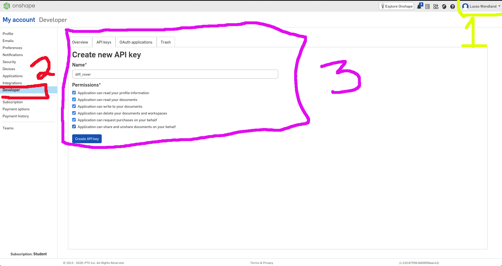

# CAD → MJCF with onshape-to-robot

This is the intended workflow for getting a new robot (or prop) from OnShape into
`assets/robots/<name>/`: export **straight to MJCF**, not through URDF. `onshape-to-robot`
has a native MuJoCo exporter, and it handles things we otherwise had to patch by hand when we
bootstrapped the rover from a pre-existing URDF, like free-floating bases, actuators, and
visual/collision splitting.

## 1. Install

`onshape-to-robot` is already a project dependency (see `pyproject.toml`), so a plain
`uv sync` (see `docs/workspace-setup.md`) is all you need. Nothing extra to install here.

You'll also need an OnShape API key and secret. Sign in, open **My account** from the
top-right menu, pick **Developer** in the left sidebar, then the **API keys** tab, name the key
and grant it permissions:



The exporter reads **three** environment variables, and all three are required:

```shell
export ONSHAPE_API=https://cad.onshape.com
export ONSHAPE_ACCESS_KEY=...
export ONSHAPE_SECRET_KEY=...
```

Keep them in the repo's gitignored `.env` and source it (`set -a; . ./.env; set +a`) rather
than putting them in `config.json`; the exporter still reads them from there but prints a
deprecation warning. Two traps in that list, both of which cost real time here:

- The secret variable is `ONSHAPE_SECRET_KEY`, not `ONSHAPE_ACCESS_SECRET`.
- `ONSHAPE_API` is easy to miss because omitting it produces the error
  `ERROR: No Onshape API access key are set`, which blames the key when the URL is what's
  absent.

The [OnShape "File Export" app](https://cad.onshape.com/appstore/apps/File%20Export/698b9abb84adb494ca5d5d5a)
can also trigger an export directly from the CAD UI if you'd rather not run the CLI.

### If you get 401 Unauthenticated with credentials that are definitely correct

Check your system clock. OnShape signs each request with the `Date` header, and rejects
anything more than a few minutes from its own clock as `{"message":"Unauthenticated API
request", "status":401}`, which is indistinguishable from a bad key. This bit us with the
machine running about six minutes fast:

```shell
# what the server thinks the time is, versus what you think it is
curl -sI https://cad.onshape.com/api/users/sessioninfo | grep -i '^date:'
date -u '+%a, %d %b %Y %H:%M:%S GMT'

timedatectl                             # "System clock synchronized: no" is the tell
sudo timedatectl set-ntp true           # the fix
```

A quick way to tell a clock problem from a bad key: HTTP Basic auth does not involve the
signature, so it still works when the signed request does not.

```shell
curl -s -o /dev/null -w '%{http_code}\n' -u "$ONSHAPE_ACCESS_KEY:$ONSHAPE_SECRET_KEY" \
  https://cad.onshape.com/api/users/sessioninfo
```

200 there plus 401 from the exporter means the credentials are fine and the clock is not.

## 2. In the OnShape assembly, before exporting

- **Root part**: leave it un-fixed if the robot should be free-floating (a rover, an arm on
  wheels). Only apply OnShape's own **Fixed** mate/feature to the root if the robot is meant
  to be bolted to the world (e.g. a stationary arm). The exporter reads that flag to decide
  whether to emit a `<freejoint>` on the root body.
- **Mate connectors** at joint axes become MJCF joints; name them something you'll recognize
  in the XML (`left_axle`, `right_axle`, etc.), same as we did by hand on the rover.

## 2b. The URL has to point at a non-empty Assembly

`onshape-to-robot` reads assemblies, never part studios. The URL in your browser points at
whichever tab you happen to be on, and a part studio tab produces:

```
! ERROR (400) while using Onshape API
! { "message" : "Element must be an assembly", "status" : 400 }
```

An assembly that exists but is empty fails differently, as a bare `KeyError: 'occurrences'`
from `assembly.py`, because the API omits that key entirely when nothing has been inserted.
Neither message names the real problem, so list the document's elements and pick the assembly
deliberately:

```shell
curl -s -u "$ONSHAPE_ACCESS_KEY:$ONSHAPE_SECRET_KEY" -H "Accept: application/json" \
  "https://cad.onshape.com/api/documents/d/<did>/w/<wid>/elements" \
| python3 -c "import json,sys; [print(e['elementType'], e['id'], e['name']) for e in json.load(sys.stdin)]"
```

Then confirm it actually contains something before exporting:

```shell
curl -s -u "$ONSHAPE_ACCESS_KEY:$ONSHAPE_SECRET_KEY" -H "Accept: application/json" \
  "https://cad.onshape.com/api/assemblies/d/<did>/w/<wid>/e/<assembly eid>" \
| python3 -c "import json,sys; print(len(json.load(sys.stdin)['rootAssembly']['instances']), 'instances')"
```

Zero instances means you need to insert the part into the assembly in OnShape first. This is
the state the `Goomba_Track` document was in: one part in the part studio, an `Assembly 1`
holding nothing.

## 2c. Props with no joints: skip the exporter

A track, a ramp, or a wall has no joints, no actuators, and no free-floating base, so none of
what `onshape-to-robot` does applies. Pull the mesh straight out of the part studio and write
a few lines of MJCF around it. The STL endpoint answers with a 307 to a *different* host
(`cad-usw2.onshape.com`), and `curl -L` drops the `Authorization` header across hosts, so
following the redirect by hand is the difference between a mesh and a 401:

```shell
URL="https://cad.onshape.com/api/partstudios/d/<did>/w/<wid>/e/<part studio eid>/stl?mode=binary&units=meter&grouping=true"
curl -s -o /dev/null -D /tmp/h.txt -u "$ONSHAPE_ACCESS_KEY:$ONSHAPE_SECRET_KEY" \
  -H "Accept: application/vnd.onshape.v1+octet-stream" "$URL"
LOC=$(awk 'tolower($1)=="location:"{print $2}' /tmp/h.txt | tr -d '\r')
curl -s -u "$ONSHAPE_ACCESS_KEY:$ONSHAPE_SECRET_KEY" \
  -H "Accept: application/vnd.onshape.v1+octet-stream" "$LOC" -o part.stl
```

Ask for `units=meter`; MuJoCo works in metres and OnShape will happily hand you millimetres.
`assets/objects/tracks/goomba_track.xml` is the result of exactly this, and shows the two
attributes a flat CAD part needs: `inertia="shell"` on the mesh, because a part 0.1 mm thick
is degenerate under MuJoCo's volume-based inertia, and `contype="0" conaffinity="0"` on the
geom, because paint on the floor is not something to drive into.

## 3. config.json

```jsonc
{
  "url": "<onshape assembly URL>",
  "output_format": "mujoco",
  "robot_name": "rover",

  // Turn on actuators per-joint. "*" is the wildcard default; override specific
  // joints below it if some (like a caster) should stay passive.
  "joint_properties": {
    "*": { "actuated": false },
    "left_axle": { "actuated": true, "type": "velocity", "kv": 0.2, "limits": [-10, 10] },
    "right_axle": { "actuated": true, "type": "velocity", "kv": 0.2, "limits": [-10, 10] }
  }
}
```

Prefer `"type": "velocity"` (or `"position"`) over `"motor"` for small/light parts like
wheels. See the gotcha below on why a raw torque motor is easy to mistune into instability.

Two things about how those keys are matched, both worth knowing before you debug a joint that
ignored its settings. Names are matched with `fnmatch`, so `"*"` matches every joint and
`"*_axle"` matches both wheels. Matches then merge **in the order the keys appear in the JSON**,
so a specific joint must come *after* the wildcard or the wildcard wins. The one exception is
the key `"default"`, which is always applied first no matter where it sits, so it is the safer
way to express "settings for everything, overridden below".

## 4. Run it, bring the output in

`onshape-to-robot` ships as a console script, not a runnable module, so `python -m
onshape_to_robot` fails with "No module named onshape_to_robot.__main__". The argument is a
path to the directory holding `config.json`, which has to be named exactly that:

```shell
mkdir -p assets/robots/rover
# write config.json into that directory first
uv run onshape-to-robot assets/robots/rover
```

Useful flags when iterating, since each full run hits the OnShape API:

```shell
uv run onshape-to-robot assets/robots/rover --retrieve   # fetch CAD only, write robot.pkl
uv run onshape-to-robot assets/robots/rover --convert    # re-export from robot.pkl, offline
```

Fetch once with `--retrieve`, then tune `config.json` and re-run `--convert` as many times as
you like without touching the network. `--safe` disables config features that run custom
commands or imports, which is what you want when running someone else's `config.json`.

This produces `robot.xml` (the mesh/body/joint/actuator tree), `scene.xml` (floor + light +
an `<include>` of `robot.xml`, the same composition pattern our hand-built
`rover_scene.xml` uses), and an `assets/` folder of STLs. Drop the whole directory under
`assets/robots/<name>/` as-is; no path rewriting needed (unlike the `package://` URDF mesh
URIs we had to `sed` earlier).

**`scene.xml` is written only if it is not already there.** Your edits to it survive a
re-export, which is the behavior you want, but it also means a scene you customized months ago
silently keeps its old contents while `robot.xml` underneath it changes. Delete it if you want
the generated one back. The generated version is minimal: a skybox, a headlight, one
directional light, and a checkerboard ground plane, with no `<option>` block at all, which is
why the integrator gotcha below is something you add rather than something you change.

## 5. Gotchas specific to the MJCF exporter

- **Explicit-Euler + velocity/position actuators + tiny inertias can blow up.** This is what
  bit us on the rover's wheels (angular velocity diverged to NaN within a few steps). MuJoCo's
  own [Numerical Integration docs](https://github.com/google-deepmind/mujoco/blob/main/doc/computation/index.rst)
  call out exactly this case: "stiff springs, position servos or strong damping interact
  with contacts," and name `implicitfast` as *"the recommended integrator for most models"*
  precisely because it has Euler's computational cost with much better stability. If you see
  `Nan, Inf or huge value in QACC` shortly after adding actuated wheels/joints, add
  `<option integrator="implicitfast"/>` to `scene.xml` before spending time retuning gains.
  It's usually the faster fix (and was the actual fix here; a `discrete` integrator swap or
  gain retuning was not needed once we made that one change).
- **Mesh collision already uses the convex hull: that wasn't our problem.** We initially
  suspected the wheel STLs themselves and swapped in cylinder collision primitives, but per
  [XMLreference.rst](https://github.com/google-deepmind/mujoco/blob/main/doc/XMLreference.rst)
  ("collision detection works with the convex hull of the mesh"), MuJoCo already collides
  every mesh via its convex hull regardless, so a coarse/non-manifold STL is not, by itself,
  a source of instability. Swapping to primitives is still worth doing for performance on
  parts that will contact the ground often, just don't expect it to fix NaNs on its own; reach
  for the integrator first.
- **Mated-but-touching parts can self-collide.** OnShape assemblies routinely have brackets,
  motors, and fasteners flush against each other by design; the exporter keeps each part as
  its own body/geom (unlike a merged URDF link), so those touching surfaces can register as
  penetrating contacts. Use `geom_properties` wildcards in `config.json` (or hand-edit
  `contype`/`conaffinity` after export) to disable collision on parts that are cosmetic or
  rigidly interior. Only surfaces that actually touch the ground or other objects need it on.
- **Sanity-check scale after export.** OnShape units, if the assembly wasn't authored in
  meters, can produce a robot that's a few orders of magnitude off: this shows up as either
  a robot floating away instantly or barely moving under normal-looking actuator commands.
- **Verify the free joint landed where you expect.** Load the model and check
  `model.njnt`/`joint names` (see the checklist below) rather than assuming the root got a
  `<freejoint>`. It's silently skipped if the root was marked Fixed in OnShape. The exporter
  names it after the root link, as `<root link name>_freejoint`, so you can grep for it.

## 6. Quick validation checklist

```python
import mujoco

m = mujoco.MjModel.from_xml_path("assets/robots/<name>/scene.xml")
d = mujoco.MjData(m)
print(m.nbody, m.njnt, m.nu)  # sanity-check body/joint/actuator counts
for i in range(m.njnt):
    print(mujoco.mj_id2name(m, mujoco.mjtObj.mjOBJ_JOINT, i), m.jnt_type[i])  # 0 = free

d.ctrl[:] = ...  # a small nonzero command
for _ in range(1000):
    mujoco.mj_step(m, d)  # no "Nan, Inf or huge value" warnings should print
print(d.qpos[:3])  # moved a sensible distance, didn't teleport or freeze
```
