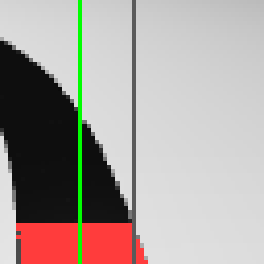
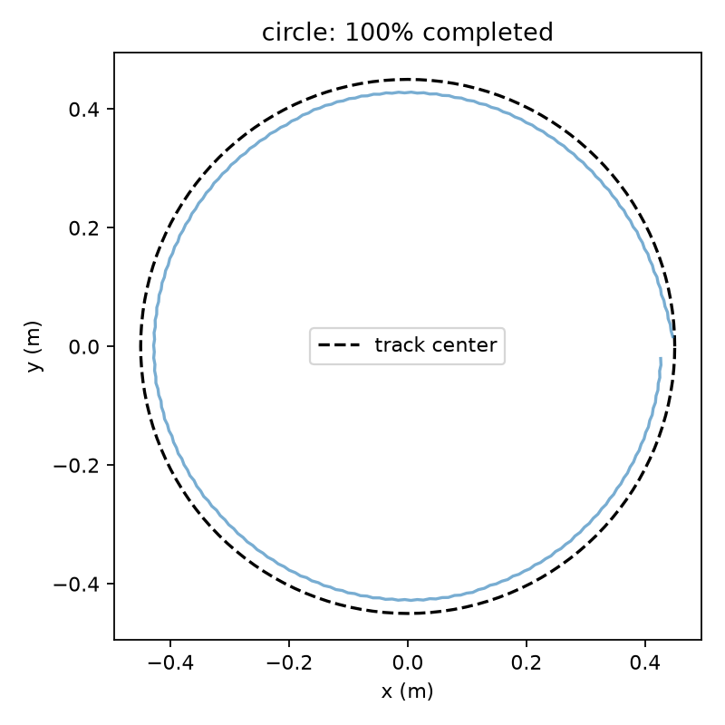

# PID line-following baseline

## What this is

This is the "no neural network" way to make the simulated rover follow a black line: a classic
PID controller looks at a strip of pixels from the onboard camera, finds where the dark line is,
and steers to keep it centered. It exists as a baseline — later, the reinforcement-learning line
followers in this repo get compared against how well this simple controller does.

## Before you start

You should already have the workspace set up (see [workspace-setup.md](workspace-setup.md)). All
commands below are run from inside `rover_mujoco/`.

## Step 1: Watch it drive

The simplest way to see it working is to open the MuJoCo viewer with the camera diagnostic
window turned on:

```sh
uv run scripts/line_follower.py --track figure8 --camera
```

A MuJoCo window pops up showing the rover driving a figure-eight track, plus a second small
window showing exactly what the onboard camera sees.

## Step 2: See exactly what the camera sees

That second window looks like this:



The controller only ever looks at the bottom strip of one camera frame — everything above it is
ignored. Red pixels are the dark line pixels it detected; green is the single column it computed
as the line's center. The gray line down the middle is the image's true center — the controller's
whole job is to steer until the green line lands on top of it.

## Step 3: Run it headlessly and check the results

For actually evaluating how good the controller is (not just watching it), run without a viewer.
This is faster and works on machines with no display:

```sh
MUJOCO_GL=egl uv run scripts/line_follower.py --headless --track circle --episodes 1 --seed 0
```

`MUJOCO_GL=egl` tells MuJoCo to render off-screen instead of opening a window — the run still
produces the same camera-overlay image and a results folder under `artifacts/pid/<timestamp>/`,
it just doesn't show anything live.

Every run saves a trajectory plot like this one:



The dashed black circle is the track's centerline; the solid blue line is the path the rover
actually drove. The title reports what fraction of the track it completed. A good run hugs the
dashed line closely and finishes near 100%; a controller that's not tuned well will drift wide on
turns or lose the line entirely partway around.

## How the controller works

Two small pieces do all the work, both in `envs/pid.py`.

First, turn one camera frame into a single number: how far left or right the line is from center,
from -1 (line at the far left) to +1 (far right), or `None` if no line is visible at all.

```python
mask[top:] = np.all(image[top:] < threshold, axis=-1)
center = (width - 1) / 2
error = (float(np.arange(width) @ weights / weights.sum()) - center) / center
```

Second, turn that error into a steering correction. This is the actual PID formula: proportional
(react to how wrong you are right now), integral (react to how wrong you've been over time), and
derivative (react to how fast the error is changing) — added together and clamped so it can't spin
the wheels arbitrarily fast.

```python
raw = self.kp * error + self.ki * self.integral + self.kd * derivative
return -float(np.clip(raw, -self.limit, self.limit))
```

## Tuning it yourself

The defaults (`--kp 2 --ki 0 --kd 0.1 --speed 3`) already pass every closed track. To see the
effect of each term, try changing one at a time and re-running Step 1:

- Higher `--kp` reacts more aggressively to being off-center, but too high starts to oscillate.
- `--kd` damps that oscillation by reacting to how fast the error is changing.
- `--ki` corrects a steady sideways bias over time; the default leaves it off (a "PD" controller).
- `--speed` is the forward wheel speed in rad/s — faster is harder to control accurately.

`--controller bang_bang` swaps in a simpler "turn hard left or hard right, no in-between"
controller for comparison.

---

## Implementation details

The sections below are reference material for extending or re-validating this baseline — not
required reading to just run it.

### Shared track assets

`scripts/line_follower.py` builds its scene through `gen_track.py`'s `build_track_xml`
and `envs/tracks.py`'s waypoint functions, both shared with the RL environments.
The baseline changed track resolution, visibility, and naming in those shared files.

The waypoint functions now default to 144 segments per shape, up from 48
(`figure8_waypoints` is unchanged at 160).
Tracks are polylines of flat boxes, so the segment count sets how closely they follow
the analytic curve.
At 48 segments the worst heading step between neighboring boxes was 11.2 degrees, which
put the centerline 1.29 mm off the true curve and pushed each box corner 1.47 mm past
its neighbor on the outside of a bend.
At 144 those figures are 3.9 degrees, 0.14 mm, and 0.51 mm: under 2% of the 2-inch tape
width, and finer than the 64×64 camera resolves.
The serration added area outside each curve, biasing the centroid outward during turns.

Track segments are emitted in geom group 2 rather than 3.
MuJoCo's default `MjvOption` mask is `[1, 1, 1, 0, 0, 0]`, so group 3 was invisible to
every renderer unless each call site re-enabled it.
Group 2 renders by default, so both the `--camera` diagnostic and the viewer show
the line without custom scene options.

Segments also carry names, `line_0`, `line_1`, and so on.
The RL environments select segments by name for appearance randomization, so
changing their geom group preserves that behavior.

Both this runner and the current `LineFollowerPPO-v0` environment pass 0.0508 m
(2 inches) through `envs/line_scene.py` to match physical tape.
`gen_track.py`'s default for standalone assets remains 0.03 m, but those narrower
assets are not the track geometry used for the reported PPO comparisons.

### Controller and measurement details

The controller samples the bottom 15% of a 64×64 RGB image, thresholds dark pixels,
and normalizes the horizontal centroid around the true pixel center.
A missing line is represented by `None`, distinct from a centered line with zero error.
Detections require at least six dark pixels, rejecting an isolated caster pixel that
otherwise made a blank floor appear to contain a centered line.

The PID uses elapsed seconds for both integral and derivative, suppresses derivative
kick on initialization/reacquisition, and freezes integration when error drives further
into saturation.
Steering is limited so both wheel commands remain within ±10 rad/s.
For the CAD joint signs, forward motion is `[-speed, +speed]` and the same steering
correction is added to both commands.

The last steering command is held through brief camera dropouts; 0.5 seconds of
consecutive missing detections stops the command and fails the episode.

### Camera assumptions

The existing XML camera settles approximately 15.4 cm above the ground.
For this PID experiment, the runner sets a **45-degree tilt from straight down**
and places the lens **5 cm above the CAD baseplate top**, at local
`[0, -0.108, 0.0256413]` m; it settles approximately 11.0 cm above the ground.
The extra 1 cm forward shift from the old mount is provisional because the physical
forward displacement was described qualitatively rather than measured.
The model's travel direction is local **−Y**, so moving the camera forward decreases Y.

The existing 60-degree vertical field of view and square image are retained as
assumptions; the reported 2.75-inch viewing distance has not yet been matched to a
particular image row or image edge.
The CAD plate settles near 6 cm above ground, slightly different from the height
inferred from the approximate physical measurements.
`--camera-tilt` changes orientation for diagnostics while holding lens position fixed;
it does not model the physical mount's movement when tilted.
These runs establish a simulation baseline, not a calibrated hardware camera model.

### Evaluation contract

Each seed adds an initial lateral offset uniformly within ±1 cm and heading offset
within ±5 degrees, then lets the chassis settle for one simulated second.
All episodes start at the same track endpoint or lap origin and travel in the
same direction.
They test small spawn perturbations, with no domain randomization or arbitrary
recovery maneuvers.

Success requires all of the following:

- Advance to within 3 cm of a full ordered lap or open-path traversal.
- Keep the base origin within **6 cm** of the corresponding track segment throughout.
- Avoid losing the line for 0.5 seconds consecutively.
- Finish within 120 simulated seconds.

The 6 cm bring-up tolerance allows the base origin beyond the tape's 2.54 cm half-width.
The evaluator projects onto a small neighborhood of the previous segment and unwraps
closed-loop arc length, preventing the figure-eight crossing from being mistaken for
a shortcut to the other branch.
Ground-truth position is used only for scoring, never as controller input.
Failures and their deviations are retained in the results, and timeouts are failures.

A zero-steering negative control (`--track figure8 --kp 0 --ki 0 --kd 0`)
failed from line loss at 5.6% progress, showing that completion requires
steering rather than a permissive progress score.

The open S-curve fails near its endpoint because the forward camera runs out of
tape before the base reaches the 3 cm finish tolerance.
Endpoint recognition remains unresolved, so the initial benchmark uses the
closed circle, figure eight, and oval tracks.

### Measured baseline (2026-09-09)

Validation used seeds 100–119, the defaults above, and 6 cm maximum base deviation.
Results and raw trajectories are in `artifacts/pid/validation`; the no-steering control
is in `artifacts/pid/no-steering`.

| Track | Completed | Mean base error | Worst base error |
|---|---:|---:|---:|
| circle | 20/20 | 2.23 cm | 2.69 cm |
| figure8 | 20/20 | 1.84 cm | 5.01 cm |
| oval | 20/20 | 1.97 cm | 4.07 cm |
| s_curve | 0/20 | 1.88 cm | 4.17 cm |

Re-running the same seeds after the track resolution went to 144 segments reproduced
every figure in this table to two decimal places, so the baseline covers the current
geometry; that run is in `artifacts/pid/revalidation-n144`.

Errors include all episodes, including incomplete S-curve trials.
The three closed tracks had zero line-loss frames across all 60 trials.
These empirical results cover small initial perturbations under fixed simulation dynamics.
Seven regression tests, Ruff lint/format, and ty passed; the viewer and camera windows
also passed a short smoke run under Xvfb.

### Verification

```sh
# Check control timing math, saturation, missing detections, crossing projection, and scene geometry.
MUJOCO_GL=egl uv run python -m pytest tests/test_pid_baseline.py -q

# Check only the files changed for this baseline.
uv run ruff check envs/pid.py envs/tracks.py scripts/gen_track.py scripts/line_follower.py tests/test_pid_baseline.py
uv run ruff format --check envs/pid.py envs/tracks.py scripts/gen_track.py scripts/line_follower.py tests/test_pid_baseline.py
uv run ty check --python ../.venv/bin/python envs/pid.py envs/tracks.py scripts/gen_track.py scripts/line_follower.py tests/test_pid_baseline.py
```

MuJoCo's compiled exports lack type stubs in this installation, so the runner uses
narrow `ty` suppressions on those binding calls, which are exercised by scene compilation
and the headless runs.
The rendering and stepping API follows the [MuJoCo Python documentation](https://mujoco.readthedocs.io/en/stable/python.html).

For further camera calibration, compare simulated and physical frames and
measure the mount's forward offset and field of view.
Tighter centering tolerances and consecutive-lap requirements remain separate
evaluation choices.
