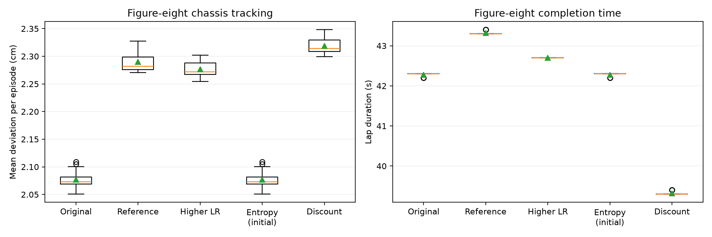

# Nominal PPO hyperparameter sweep

## What this is

This experiment asks a simple question: if we keep training an already-good line-following
policy for longer, does it get better, worse, or stay the same? We take one qualified PPO
policy and continue training it four different ways (three small hyperparameter tweaks plus an
unchanged baseline, all given the same extra training budget), then pick whichever version
actually holds up best across the test tracks.

## Before you start

This sweep continues from the qualified nominal camera-reward policy trained in
[ppo-line-follower.md](ppo-line-follower.md) (20/20 completions on circle, figure-eight, and
oval). It does not train from scratch and does not test domain randomization — see
[dr-bam-line-follower.md](dr-bam-line-follower.md) for that.

## Step 1: Why camera reward, not chassis reward

Before sweeping hyperparameters, an earlier reward-shaping ablation compared two ways of scoring
"how centered is the rover on the line": one measured from the camera image, one measured from
the rover's chassis position. Camera reward is the one this whole line-following project uses,
and here's the evidence why: under the same training budget, the camera-reward policy passed
every reserved test episode, while the chassis-reward policy failed most figure-eight episodes.


Each line in this plot is one evaluation episode's path around the figure-eight; a policy that
generalizes well produces tight, consistent loops instead of scattered or cut-off paths. See
[Implementation details](#implementation-details) for the full ablation numbers.

## Step 2: Run the sweep

This one command trains all four candidates (with matched settings and budget), logs each to
Weights & Biases, and automatically tests whichever one wins:

```sh
# Run the four matched continuations, log them to W&B, and independently test the winner.
MUJOCO_GL=egl OMP_NUM_THREADS=1 OPENBLAS_NUM_THREADS=1 uv run scripts/sweep_ppo.py runs/ppo-continued-seed0/best_model.zip --output runs/ppo-hparam-sweep-seed0
```

The four candidates being compared:

| Candidate | Changed parameter | Reference value | Candidate value | Description |
|---|---|---:|---:|---|
| `reference` | None | — | — | Continue with the qualified run's original hyperparameters as a matched-budget control. |
| `learning_rate` | Learning rate | 0.0003 | 0.001 | Test larger optimizer updates while keeping the PPO clipping rule unchanged. |
| `entropy` | Entropy coefficient | 0.005 | 0.0 | Remove the explicit entropy bonus while retaining stochastic rollout actions. |
| `discount` | Discount factor | 0.995 | 0.98 | Give distant rewards less weight in return and advantage estimation. |

Everything else (camera reward, the three-track mixture, the action/observation contract) is
held fixed across all four, so any difference in outcome is attributable to the one changed
parameter. Full protocol details (validation cadence, selection rule, benchmark seeds) are in
[Implementation details](#implementation-details).

## Step 3: Read the results

All four candidates already pass the easier common benchmark, so the real comparison is on
harder held-out validation data:

| Candidate | Selected additional steps | Mean validation return | Figure-eight mean deviation (cm) | Figure-eight mean lap time (s) |
|---|---:|---:|---:|---:|
| Original qualified policy | 0 | 241.05 | 2.08 | 42.28 |
| Reference continuation | 25,002 | **264.68** | 2.29 | 43.32 |
| Learning rate 0.001 | 50,004 | 263.65 | 2.28 | 42.70 |
| Entropy coefficient 0 | 0 | 241.05 | 2.08 | 42.28 |
| Discount factor 0.98 | 25,002 | 257.85 | 2.32 | **39.32** |

Read the "additional steps" column as "how much more training this candidate's *selected*
checkpoint actually got before it started overfitting or regressing" — 0 means the sweep decided
the original, untouched policy was still the best version of that candidate, not that it never
trained.




The **reference continuation** won: same hyperparameters as the original, just trained a bit
more. Two takeaways worth noticing: (1) validation return, accuracy (deviation), and lap speed
each favored a *different* candidate here, so "best" always depends on which one you care about
most; (2) the discount-factor candidate finished laps about 7% faster at the cost of about 12%
more deviation — a real speed/accuracy trade-off, not noise. The full analysis, including which
candidates regressed and why, is in [Implementation details](#implementation-details).

## Step 4: Confirm the winner on fresh data

The winner only "counts" once it's tested on episodes it never saw during selection. The
reference continuation passed all 50 fresh episodes per track (150 total, seeds 20000-20049):

| Track | Completed | Success rate | Mean base deviation (cm) | Maximum base deviation (cm) | Mean lap time (s) |
|---|---:|---:|---:|---:|---:|
| Circle | 50/50 | 100% | 3.50 | 3.74 | 21.27 |
| Figure-eight | 50/50 | 100% | 2.29 | 5.71 | 43.31 |
| Oval | 50/50 | 100% | 3.06 | 5.19 | 24.73 |

That clears the project's bar of at least 90% success on every track. To watch this exact
checkpoint drive in the viewer yourself:

```sh
# View the sweep's selected checkpoint on its saved three-track protocol.
uv run scripts/evaluate_ppo.py runs/ppo-hparam-sweep-seed0/reference/best_model.zip --episodes 1 --viewer
```

## Next step: get the policy

See [Download and run saved policies](policy-downloads.md) for the Hugging Face checkpoint and
configuration downloads, a 3D viewer command, and optional Python loading from the local HF
cache.

---

## Implementation details

The sections below are reference material for reproducing or auditing this sweep — not required
reading to understand the result.

### Reward ablation numbers

The preceding reward ablation used the same starting checkpoint and 150,000-step request
for each run, with the following reserved-seed results:

| Reward | Circle | Figure-eight | Oval | Figure-eight mean deviation (cm) |
|---|---:|---:|---:|---:|
| Camera | 20/20 | 20/20 | 20/20 | 2.08 |
| Chassis | 20/20 | 4/20 | 20/20 | 1.74 |

Chassis centering remains an opt-in ablation; its lower mean deviation includes failed
episodes and does not establish reliable track completion.
The [camera run](https://wandb.ai/cursedrock17-university-of-maryland/rover-line-follower/runs/hzl1xy2f)
is the qualified starting point for this sweep, and the
[chassis run](https://wandb.ai/cursedrock17-university-of-maryland/rover-line-follower/runs/ixa9l8vr)
retains its separate artifacts.

### Fixed protocol

Every candidate starts from `runs/ppo-continued-seed0/best_model.zip`, representing
199,992 cumulative environment interactions, and requests 50,000 additional steps with
six workers and training seed 0.
SB3 completes whole rollouts, making the actual additional budget 52,224 steps.
The sweep snapshots its code, assets, checkpoint, and checkpoint lineage before starting;
later workspace edits cannot change one candidate's environment relative to another's.

Each candidate validates the incoming checkpoint at step zero and again every 25,000
additional steps, using five episodes per track with seeds 1000-1004.
The best checkpoint ranks first by its worst track's completion rate, then by average
validation return; the incoming checkpoint remains eligible if fine-tuning degrades it.
The same validation rule selects the sweep winner.

Candidate evaluation on seeds 10000-10019 is retained as a common benchmark and is not
used for selection.
Only after selection, the winner receives 50 fresh episodes per track on seeds
20000-20049, with deterministic actions and the same failure criteria.
An observed success rate of at least 90% on **every** track is required for that final
test to pass.
The newer Goomba track is excluded from this controlled three-track comparison.

These parameters follow the [SB3 PPO API](https://stable-baselines3.readthedocs.io/en/master/modules/ppo.html),
with separate validation and final testing following the
[SB3 evaluation guidance](https://stable-baselines3.readthedocs.io/en/master/guide/rl_tips.html).

### Artifacts produced

The sweep writes a root configuration and `source_manifest.json` before training.
Each candidate has its own output directory, W&B training run, log, full configuration,
validation history, best/final policies, checkpoints, numerical training scalars,
training figure, evaluation CSVs, trajectories, and camera videos.
`summary.json` records completed candidates, and `winner.json` records the selected
checkpoint's SHA-256, selection rule, fresh test rates, and pass/fail result.
`final_evaluation` holds the winner's independent test artifacts.
Training and final evaluation runs share the W&B group `ppo-hparam-sweep-seed0`.

The training CLI accepts `--gamma` and `--tracks` for reproducible comparisons.
The evaluator defaults to the saved configuration's tracks, so adding a registered
track does not silently change an older checkpoint's evaluation protocol.
Explicit `--tracks` can be used to evaluate additional geometries separately.
`prior_timesteps` includes earlier continuations' cumulative interactions, while
`checkpoint_timesteps` records SB3's local counter from the loaded checkpoint.

The numerical comparison is saved as `candidate_comparison.csv` in the sweep directory.

### Full results analysis

The reference continuation won by the declared validation score while retaining the
original learning rate, entropy coefficient, and discount factor.
It regressed to 0/5 figure-eight validation completions at the final training checkpoint,
making preservation of the earlier selected model essential.
The entropy candidate also regressed and retained its incoming policy; its benchmark
repeats the original policy's same 20 cases and is not evidence of a learned improvement.

The original policy had the lowest mean figure-eight chassis deviation.
The shorter discount horizon completed laps about 7.0% faster with about 11.6%
greater mean deviation.
Validation return, accuracy, and speed therefore favored different policies.
The original provides an accuracy control for DR/BAM, while the shorter-horizon
candidate shows the cost of faster laps.

### Verification

The fresh result passes the requested observed 90% success threshold on every benchmark
track, under nominal simulation conditions.
The [final W&B evaluation](https://wandb.ai/cursedrock17-university-of-maryland/rover-line-follower/runs/g09tliwh)
contains these metrics, trajectories, and the selected-model artifact; the
[reference training run](https://wandb.ai/cursedrock17-university-of-maryland/rover-line-follower/runs/rcq1b6au)
contains the hyperparameters and training curves.

The selected model SHA-256 is
`648c6764241380cc2464e71b42585a0a7ac940cc9808deb28c1c55d85a006163`.
The final audit verified every snapshot-file hash, matched all four saved models to
their recorded selected steps, and checked all fresh episode seeds and success counts.
At sweep completion, the 30-test suite passed from `rover_mujoco`, changed Python
files passed Ruff and ty, and repository-wide formatting and lint passed.
The full type check then reported 124 diagnostics outside those changes.
Rerun the checks for the current checkout.
