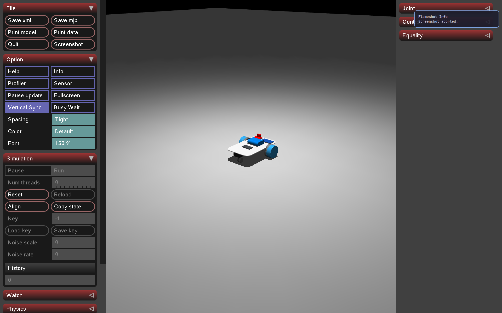

# Simple control: driving the rover with a keyboard

## What this is

Once you've got the rover into simulation (`assets/robots/rover/`, either from
[onshape-to-robot-mjcf.md](onshape-to-robot-mjcf.md)'s export or the copy already in this repo),
the next step is just driving it around by hand. `scripts/teleop_rover.py` maps arrow-key presses
to the rover's two wheels using differential-drive kinematics — the same math every two-wheeled
robot uses to turn.

## The kinematics, briefly

The rover has two independently-driven wheels on a common axle plus a passive front caster.
Given a desired forward speed `v` and turn rate `ω`, the standard differential-drive mixing is:

```
ω_left  = v - ω * b / 2
ω_right = v + ω * b / 2
```

where `b` is the distance between the wheels and `ω_left`/`ω_right` are the wheel angular
velocities you actually command. Setting `ω_left = ω_right` drives straight; equal-and-opposite
values spin the rover in place; everything else arcs.

`teleop_rover.py` doesn't use the wheel-spacing term `b` directly since it commands `left`/`right`
target velocities straight into MuJoCo's wheel actuators rather than computing a physical arc
radius. The mixing it actually uses is:

```python
action = [-linear + angular, linear + angular]  # [left_ctrl, right_ctrl]
```

The leading `-` on the left wheel isn't part of the textbook kinematics. It's a quirk of this
specific rover's CAD: the wheel meshes are mirrored, so the two wheel joints spin in opposite
senses for the same physical rolling direction. We found this the hard way (see the
`rover_env.py`/teleop debugging in this repo's history): driving forward needed
opposite-signed `ctrl` on the two wheels, not the equal-signed pair you'd expect from the
kinematics alone. If you export a new rover from OnShape and its wheels *aren't* mirrored,
you may need to drop that sign flip.

## Controls

- **Arrow keys** (not WASD): forward/backward and turn left/right. Hold a key down to
  keep driving - the rover only moves while a key is (recently) pressed, same as the real
  rover only drives for as long as it keeps receiving fresh commands.
- `+` and `-` raise or lower the top speed, in 0.5 rad/s steps.
- Space stops the rover.
- Esc exits the viewer.

Arrow keys instead of WASD is a deliberate choice, not an oversight. MuJoCo's own viewer binds
every letter of the alphabet to a built-in rendering toggle (`W` is Wireframe, `S` is Shadow,
`A` is Auto Connect, `D` is Static Body) and it processes those on every keypress regardless
of what our own key handler does. Driving with WASD would flip one of those every time you
touched a key (this is exactly what caused the "floor turns into a grid" bug earlier). Arrow
keys aren't bound to anything in MuJoCo's shortcut tables, so they don't have that problem.

## Speed limits come from the real motors, not guesses

The rover's JGA25-371 gearmotors are rated for 463 RPM at the wheel shaft. Converted to
rad/s and capped well under that rating, that sets `teleop_rover.py`'s adjustable top speed
range. There's also a floor: a rough placeholder for the minimum wheel speed needed to
actually overcome static friction and roll, rather than just stall the motor against the
floor. That floor is an estimate, not a measured value, and getting the real number is
future work once the motors are being modeled with BAM (a later tutorial).

## One command per loop tick, just like the real rover

`teleop_rover.py` runs its own loop at `COMMAND_RATE_HZ` (10 Hz, matching the real rover
firmware's `rover_control/rover.py`), sending one wheel-speed command per tick and holding it
for that tick's duration - it doesn't ramp up to a target speed. A key press is only
remembered for one tick, so a direction key has to keep getting re-pressed (which is what
holding it down does, via keyboard auto-repeat) to keep the rover moving. This mirrors how
the real rover's control loop works: no smoothing in the loop itself, just a steady stream of
fresh commands.

## Running it

This opens the MuJoCo viewer with the rover loaded and your keyboard live:

```shell
uv run python scripts/teleop_rover.py
```

This should open a MuJoCo viewer with the rover model loaded:



If the viewer opens and arrow keys drive the rover without the floor flickering into a grid,
everything's wired up correctly.
